## 傅里叶变换(fourier transform)
- 原文作者：韩 昊
- 谨以此文献给大连海事大学的吴楠老师，柳晓鸣老师，王新年老师以及张晶泊老师。
- 这不止是一篇好的文章，更是一片真心付出的文章，值得这个回报。
#### 频域
- 从我们出生，我们看到的世界都以时间贯穿，股票的走势、人的身高、汽车的轨迹都会随着时间发生改变。这种以时间作为参照来观察动态世界的方法我们称其为时域分析。
- 而我们也想当然的认为，世间万物都在随着时间不停的改变，并且永远不会静止下来。但如果我告诉你，用另一种方法来观察世界的话，你会发现世界是永恒不变的，你会不会觉得我疯了？我没有疯，这个静止的世界就叫做频域。
- 先举一个公式上并非很恰当，但意义上再贴切不过的例子：
- 在你的理解中，一段音乐是什么呢？  
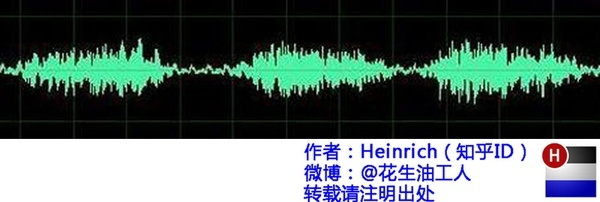
- 这是我们对音乐最普遍的理解，一个随着时间变化的震动。但我相信对于乐器小能手们来说，音乐更直观的理解是这样的：  
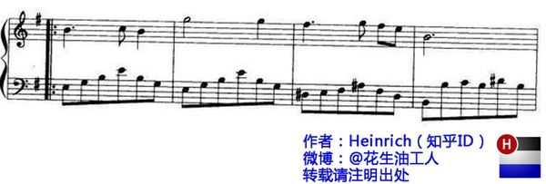
- 上图是音乐在时域的样子，而下图则是音乐在频域的样子。所以频域这一概念对大家都从不陌生，只是从来没意识到而已。
- 将以上两图简化：
- 时域：  

- 频域：  

- 在时域，我们观察到钢琴的琴弦一会上一会下的摆动，就如同一支股票的走势；而在频域，只有那一个永恒的音符。
- 所以，你眼中看似落叶纷飞变化无常的世界，实际只是躺在上帝怀中一份早已谱好的乐章。
#### 傅里叶告诉我们：任何周期函数，都可以看做是不同振幅，不同相位正弦波的叠加。
- 贯穿时域与频域的方法之一，就是傅里叶分析。
#### 傅里叶级数(fourier series)的频谱
- 使用正弦曲线波叠加出一个带90度角的矩形波。  
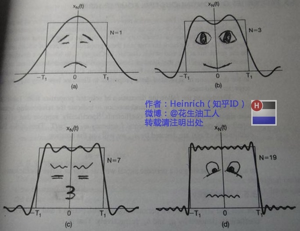
- 第一幅图是一个郁闷的正弦波cos(x)
- 第二幅图是 2 个卖萌的正弦波的叠加cos(x)+a.cos(3x)
- 第三幅图是 4 个发春的正弦波的叠加
- 第四幅图是 10 个便秘的正弦波的叠加
- 随着正弦波数量逐渐的增长，他们最终会叠加成一个标准的矩形，大家从中体会到了什么道理？（只要努力，弯的都能掰直！）
- 随着叠加的递增，所有正弦波中上升的部分逐渐让原本缓慢增加的曲线不断变陡，而所有正弦波中下降的部分又抵消了上升到最高处时继续上升的部分使其变为水平线。一个矩形就这么叠加而成了。但是要多少个正弦波叠加起来才能形成一个标准 90 度角的矩形波呢？不幸的告诉大家，答案是无穷多个。
- 不仅仅是矩形，你能想到的任何波形都是可以如此方法用正弦波叠加起来的。
- 还是上图的正弦波累加成矩形波，我们换一个角度来看看：  
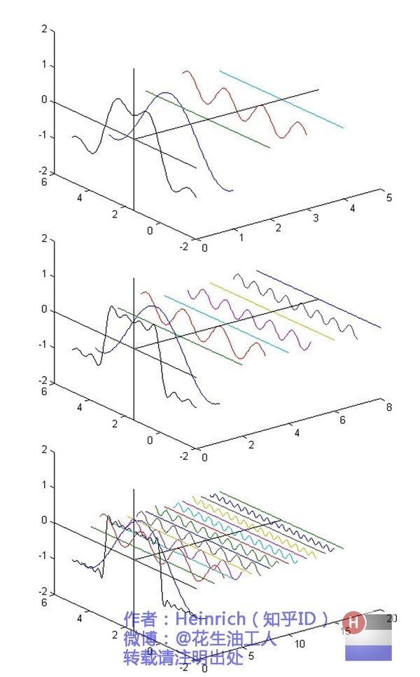
- 在这几幅图中，最前面黑色的线就是所有正弦波叠加而成的总和，也就是越来越接近矩形波的那个图形。
- 而后面依不同颜色排列而成的正弦波就是组合为矩形波的各个分量。这些正弦波按照频率从低到高从前向后排列开来，而每一个波的振幅都是不同的。
- 每两个正弦波之间都还有一条直线，那并不是分割线，而是振幅为 0 的正弦波！
- 也就是说，为了组成特殊的曲线，有些正弦波成分是不需要的。这里，不同频率的正弦波我们成为频率分量。
- 时域的基本单元就是“1 秒”，如果我们将一个角频率为w0的正弦波 cos（w0t）看作基础，那么频域的基本单元就是w0。
- 有了“1”，还要有“0”才能构成世界，那么频域的“0”是什么呢？cos（0t）就是一个周期无限长的正弦波，也就是一条直线！
- 在频域，0 频率也被称为直流分量，在傅里叶级数的叠加中，它仅仅影响全部波形相对于数轴整体向上或是向下而不改变波的形状。  

- 正弦波就是一个圆周运动在一条直线上的投影。所以频域的基本单元也可以理解为一个始终在旋转的圆.  

- 介绍完了频域的基本组成单元，我们就可以看一看一个矩形波，在频域里的另一个模样了：  
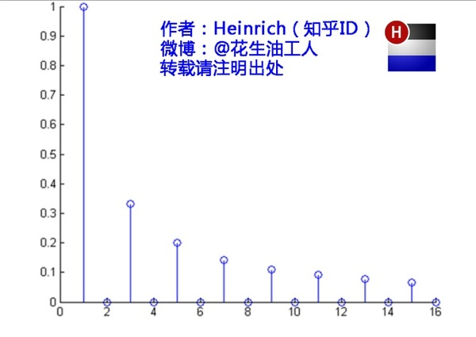
- 这就是矩形波在频域的样子，是不是完全认不出来了？教科书一般就给到这里然后留给了读者无穷的遐想，以及无穷的吐槽，其实教科书只要补一张图就足够了：频域图像，也就是俗称的频谱，就是——  
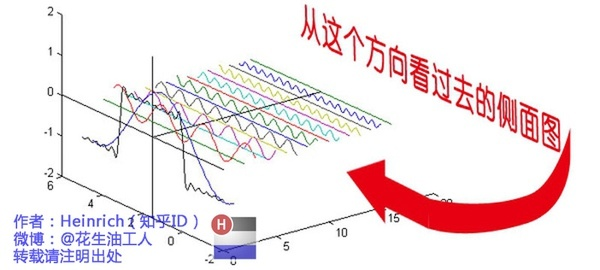
- 再清楚一点：  

- 可以发现，在频谱中，偶数项的振幅都是0，也就对应了图中的彩色直线。振幅为 0 的正弦波。  

#### 傅里叶级数(fourier series)的相位谱
- 所以很多在时域看似不可能做到的数学操作，在频域相反很容易。这就是需要傅里叶变换的地方。尤其是从某条曲线中去除一些特定的频率成分，这在工程上称为滤波，是信号处理最重要的概念之一，只有在频域才能轻松的做到。
- 通过时域到频域的变换，我们得到了一个从侧面看的频谱，但是这个频谱并没有包含时域中全部的信息。因为频谱只代表每一个对应的正弦波的振幅是多少，而没有提到相位。
- 基础的正弦波A.sin(wt+θ)中，振幅，频率，相位缺一不可，不同相位决定了波的位置，所以对于频域分析，仅仅有频谱（振幅谱）是不够的，我们还需要一个相位谱。那么这个相位谱在哪呢？我们看下图：  
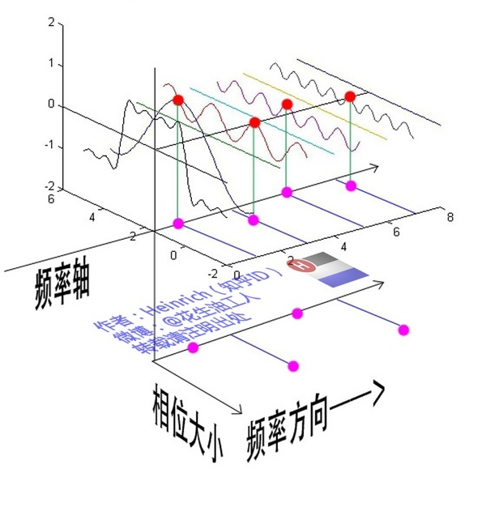
- 鉴于正弦波是周期的，我们需要设定一个用来标记正弦波位置的东西。在图中就是那些小红点。
- 小红点是距离频率轴最近的波峰，而这个波峰所处的位置离频率轴有多远呢？为了看的更清楚，我们将红色的点投影到下平面，投影点我们用粉色点来表示。
- 当然，这些粉色的点只标注了波峰距离频率轴的距离，并不是相位。  
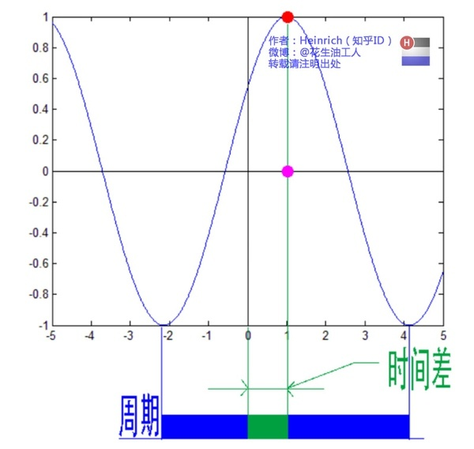
- 这里需要纠正一个概念：时间差并不是相位差。如果将全部周期看作2Pi或者360度的话，相位差则是时间差在一个周期中所占的比例。我们将时间差除周期再乘2Pi，就得到了相位差。
- 在完整的立体图中，我们将投影得到的时间差依次除以所在频率的周期，就得到了最下面的相位谱。所以，频谱是从侧面看，相位谱是从下面看。
- 最后来一张大集合：    

#### 傅里叶变换(fourier tranformation)
- 傅里叶级数的本质是将一个周期的信号分解成无限多分开的(离散的)正弦波。
- 比如傅里叶级数，在时域是一个周期且连续的函数，而在频域是一个非周期离散的函数。
- 而在我们接下去要讲的傅里叶变换，则是将一个时域非周期的连续信号，转换为一个在频域非周期的连续信号。  

- 或者我们也可以换一个角度理解：傅里叶变换实际上是对一个周期无限大的函数进行傅里叶变换。
- 我们这次从另一个角度来看频谱，还是傅里叶级数中用到最多的那幅图，我们从频率较高的方向看。  

- 以上是离散谱，那么连续谱是什么样子呢？想象这些离散的正弦波离得越来越近，逐渐变得连续……直到变得像波涛起伏的大海：  

- 原来离散谱的叠加，变成了连续谱的累积。所以在计算上也从求和符号变成了积分符号。
#### 欧拉公式
- 虚数i这个概念大家在高中就接触过，但那时我们只知道它是-1 的平方根，可是它真正的意义是什么呢?  
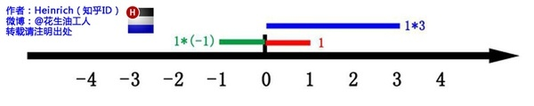
- 这里有一条数轴，在数轴上有一个红色的线段，它的长度是1。当它乘以 3 的时候，它的长度发生了变化，变成了蓝色的线段，而当它乘以-1 的时候，就变成了绿色的线段，或者说线段在数轴上围绕原点旋转了 180 度。
- 
我们知道乘-1 其实就是乘了两次 i 使线段旋转了 180 度，那么乘一次 i 呢——答案很简单——旋转了 90 度。  
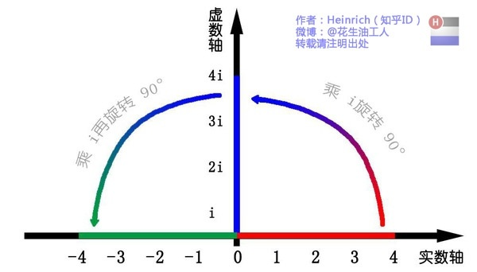
- 同时，我们获得了一个垂直的虚数轴。实数轴与虚数轴共同构成了一个复数的平面，也称复平面。这样我们就了解到，乘虚数i的一个功能——旋转。  
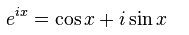
- 欧拉公式在数学领域的意义要远大于傅里叶分析，它的特殊形式——当x等于 Pi 的时候。  
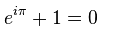
- 这个公式关键的作用，是将正弦波统一成了简单的指数形式。我们来看看图像上的涵义：  
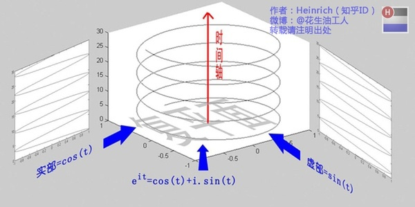
- 欧拉公式所描绘的，是一个随着时间变化，在复平面上做圆周运动的点，随着时间的改变，在时间轴上就成了一条螺旋线。
- 如果只看它的实数部分，也就是螺旋线在左侧的投影，就是一个最基础的余弦函数。而右侧的投影则是一个正弦函数。  
#### 指数形式的傅里叶变换
- 有了欧拉公式的帮助，我们便知道：正弦波的叠加，也可以理解为螺旋线的叠加在实数空间的投影。而螺旋线的叠加如果用一个形象的栗子来理解是什么呢？
- 高中时我们就学过，自然光是由不同颜色的光叠加而成的，而最著名的实验就是牛顿师傅的三棱镜实验：  
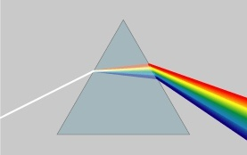
- 所以其实我们在很早就接触到了光的频谱，只是并没有了解频谱更重要的意义。
- 但不同的是，傅里叶变换出来的频谱不仅仅是可见光这样频率范围有限的叠加，而是频率从 0 到无穷所有频率的组合。
- 这里，逆时针旋转的我们称为正频率，而顺时针旋转的我们称为负频率（注意不是复频率）。
-连续的螺旋线会是这个样子：  

- 这个图形在时域是这个样子：  
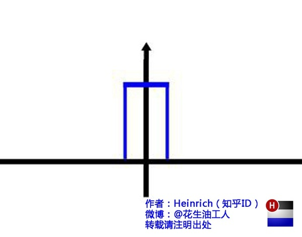
- 如果你认真去看，海螺图上的每一条螺旋线都是可以清楚的看到的，每一条螺旋线都有着不同的振幅（旋转半径），频率（旋转周期）以及相位。而将所有螺旋线连成平面，就是这幅海螺图了。
- 好了，讲到这里，相信大家对傅里叶变换以及傅里叶级数都有了一个形象的理解了，我们最后用一张图来总结一下：  
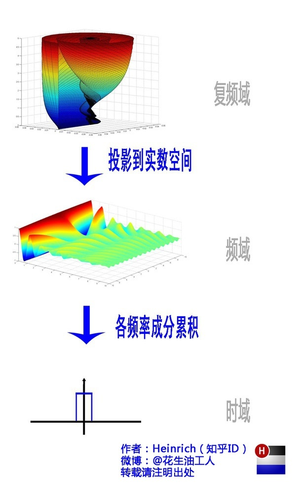
- 老实说，数学工具对于工科生和对于理科生来说，意义是完全不同的。工科生只要理解了，会用，会查，就足够了。但是很多高校却将这些重要的数学课程教给数学系的老师去教。这样就出现一个问题，数学老师讲得天花乱坠，又是推理又是证明，但是学生心里就只有一句话：学这货到底干嘛用的？
- 在开始学习一门数学工具的时候，学生完全不知道这个工具的作用，现实涵义。而教材上有只有晦涩难懂，定语就二十几个字的概念以及看了就眼晕的公式。能学出兴趣来就怪了！
- 本文只是介绍了一种对傅里叶分析新颖的理解方法，对于求学，还是要踏踏实实弄清楚公式和概念，学习，真的没有捷径。但至少通过本文，我希望可以让这条漫长的路变得有意思一些。

