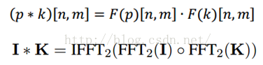
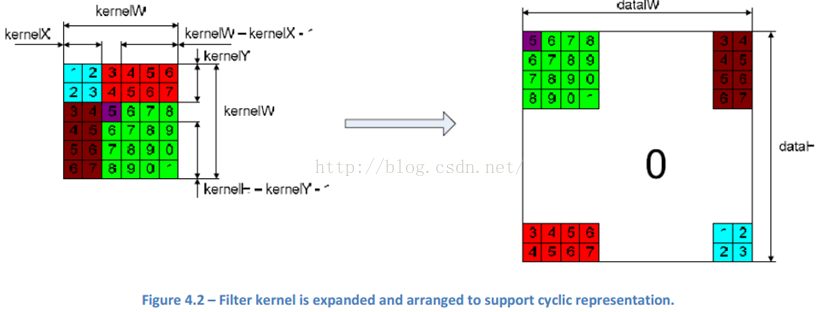
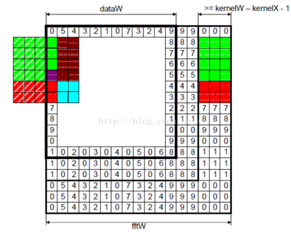

## 频域(frequency domain)滤波
- 频率域：（frequency domain。）任何一个波形都可以分解用多个正弦波之和。
- 频率域是由傅里叶变换和频率变量 (u,v)定义的空间，频域滤波处理过程：先对图像进行[傅里叶变换](https://github.com/zhudingsuifeng/basicknowledge/blob/master/FourierTransform.md)，转换至频率
域，在频域使用滤波函数进行滤波，最后将结果反变换至空间域。
- 频域计算-快速傅里叶变换FFT卷积
#### 这个快速实现得益于卷积定理：时域上的卷积等于频域上的乘积。所以将我们的图像和滤波器通过算法变换到频域后，直接将他们相乘，然后再变换回时域（也就是图像的空域）就可以了。  

- o表示矩阵逐元素相乘。那用什么方法将空域的图像和滤波器变换到频域了。那就是鼎鼎大名的Fast Fourier Transformation 快速傅里叶变换FFT.  
-  要在频域中对一副图像进行滤波，滤波器的大小和图像的大小必须要匹配，这样两者的相乘才容易。因为一般滤波器的大小比图像要小，所以我们需要拓展我们的kernel，让它和图像的大小一致。
- 扩展本质上就是把滤波器分解之后摆在相应位置，中间空余补零(zero padding).    

- 为了保证图像边界的像素也可以得到响应输出，我们也需要拓展我们的输入图像。同时，拓展的方式也要支持周期表达。  

- 我们所看到的图像，均为空间域内的表现形式，我们无法辨识出频域内的图像。要进行频域内的滤波器处理，首先就需要进行傅里叶变换，然后直接进行滤波处理，最后再用反傅里叶变换倒回到空间域内。
- 所以很多在时域看似不可能做到的数学操作，在频域相反很容易。这就是需要傅里叶变换的地方。尤其是从某条曲线中去除一些特定的频率成分，这在工程上称为滤波，是信号处理最重要的概念之一，只有在频域才能轻松的做到。
- 频谱（振幅谱）
#### 图像频域滤波
- 图像中不同灰度级（或颜色）在空间上的分布，称为空域（spatial domain）。用x(n1,n2)表示图像在(n1,n2)点上的强度值。
- 图像中灰度级的变化的快慢，称为频域（frequency domain）。用X(ω1,ω2)表示图像在频率(ω1,ω2)处的强度值，因为图像是二维的，因此其频率变化也是二维的。
- 频域分析把图像分解为从低频到高频的频率成分。图像强度变化慢的区域只包含低频成分；强度值快速变化的区域产生高频成分。
- 通过傅里叶变换或余弦变化可以清楚地显示图像的频率成分。图像是二维的，因此频率分两种，即垂直频率（垂直方向的变化ω1）和水平频率（水平方向的变化ω2）。
- 在频域分析的框架下，滤波器是一种放大图像中某些频段，同时滤掉（或减弱）其他频段的算子。
- 低通滤波器（LPF, Low Pass Filter）就是消除高频部分，让低频分量通过；高通滤波器（HPF, High Pass Filter）就是消除低频部分，让高频分量通过。
#### 之所以可以选择性的让某些频段通过，是因为图像滤波使用了逐个像素进行二维离散卷积的形式实现，而我们知道对空域信号的卷积相当于在频域的乘积。
- 因此，滤波核的频率响应H(ω1,ω2)乘原始像素的频谱X(ω1,ω2)，相当于滤除了滤波核频谱较低位置的频率分量，而只有滤波和频谱较高区域的频率分量得以通过。
- 下面的h(n1,n2)为一个低通滤波器的滤波核，也就是冲激响应:  

- 一个5×5的高斯滤波器：  

- 下面的h(n1,n2)为一个高通滤波器的滤波核:  
