## (Image Local Feature Point Detection)图像局部特征点检测
- 图像特征可以包括颜色特征、纹理特征、形状特征以及局部特征点等，其中局部特征点具有很好的稳定性，不容易受外界环境干扰。
### 局部特征点
- 图像特征提取是图像分析与图像识别的前提，它是将高维的图像数据进行美化表达最有效的方式，从一幅图像的M*N*3的数据矩阵中，我们看不出任何信息，所以我们必须根据这些数据提取出图像中的关键信息，一些基本元件以及它们的关系。
- 局部特征点是图像特征的局部表达，他只能表征图像上具有的局部特殊性，所以它只适合于对图像进行匹配，检索等应用。对于图像理解则不太适合。
- 图像理解更关心一些全局特征，如颜色分布，纹理特征，主要物体的形状等。
- 全局特征容易受到环境的干扰，光照，旋转，噪声等不利因素都会影响全局特征。相比而言，局部特征点，往往对应着图像中的一些线条交叉，明暗变化的结构中，受到的干扰也少。
- 而斑点与角点是两类局部特征点。斑点通常是指与周围有着颜色和灰度差别的区域，如草原上的一棵树或一栋房子。它是一个区域，所以它比角点的抗噪能力要强，稳定性要好。而角点则是图像中一边物体的拐角或者线条之间的交叉部分。
### 斑点检测
- 斑点检测的主要思路都是检测出图像中比它周围像素灰度值大或比周围灰度值小的区域。一般有两种方法来实现这一目标：
1. 基于求导的微分方法，这类的方法称为微分检测器；
2. 基于局部极值的分水岭算法。
#### LoG
- 斑点检测的方法主要包括利用高斯拉普拉斯算子检测的方法(LOG),以及利用像素点Hessian矩阵(二阶微分)及其行列式的方法(DOH)。
- 利用高斯拉普拉斯(Laplace of Gaussian,LoG)算子检测图像斑点是一种十分常用的方法，对于二维高斯函数：  
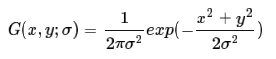
- 它的拉普拉斯变换为：  
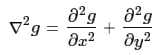
- 规范化的高斯拉布拉斯变换为：  
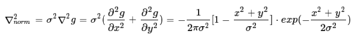
- 规范化算子在二维图像上显示是一个圆对称函数，如下图所示。因为二维高斯函数的拉普拉斯核很像一个斑点，所以可以利用卷积来求出图像中的斑点状的结构。并且可以通过改变σ的值，可以检测不同尺寸的二维斑点。  
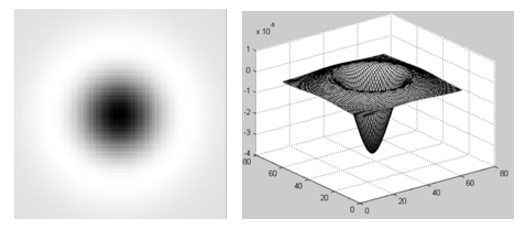
- 其实从更直观的角度去解释为什么LOG算子可以检测图像中的斑点是：
#### 图像与某一个二维函数进行卷积运算实际就是求取图像与这一函数的相似性。同理，图像与高斯拉普拉斯函数的卷积实际就是求取图像与高斯拉普拉斯函数的相似性。当图像中的斑点尺寸与高斯拉普拉斯函数的形状趋近一致时，图像的拉普来响应达到最大。
- 从概率的角度解释为：假设原图像是一个与位置有关的随机变量X的密度函数，而LOG为随机变量Y的密度函数，则随机变量X+Y的密度分布函数即为两个函数的卷积形式。如果想让X+Y能取到最大值，则X与Y能保持步调一致最好，即X上升时，Y也上升，X最大时，Y也最大。
- Laplace可以用来检测图像中的局部极值点，但是对噪声敏感，所以在我们对图像进行Laplace卷积之前，我们用一个高斯低通滤波对图像进行卷积，目标是去除图像中的噪声点。这一过程 可以描述为:
- 先对图像f(x,y)用方差为σ的高斯核进行高斯滤波，去除图像中的噪点。  
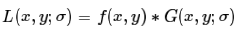
- 然后对图像的拉普拉斯图像则为：  
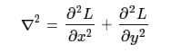
- 而实际上有下面等式：  
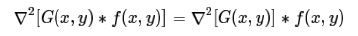
- 所以，我们可以先求高斯核的拉普拉斯算子，再对图像进行卷积。也就是一开始描述的步骤。
- 我们注意到当σ尺度一定时，只能检测对应半径的斑点，那么检测的是多大半径的斑点呢，我们可以通过对规范化的二维拉普拉斯高斯算子求导：
- 规范化的高斯拉普拉斯函数为：  
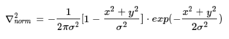
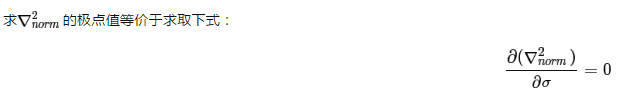
- 得到：  
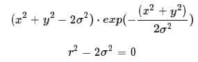
- 对于图像中的斑点，在尺度σ=r/√2时，高斯拉普拉斯响应值达到最大。同理，如果图像中的圆形斑点黑白反向，那么，它的高斯拉普拉斯响应值在σ=r/√2时达到最小。
- 将高斯拉普拉斯响应达到峰值时的尺度σ值，称为特征尺度。
- 那么在多尺度的情况下，同时在空间和尺度上达到最大值（或最小值）的点就是我们所期望的斑点。
- 对于二维图像I(x,y)，计算图像在不同尺度下的离散拉普拉斯响应值，然后检查位置空间中的每个点；如果该点的拉普拉斯响应值都大小于或小于其他26个立方空间领域(9+8+9)的值，那么该点就是被检测到的图像斑点。  
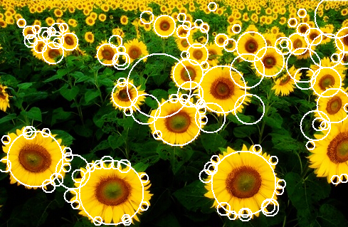
#### DoG
- Difference of Gaussian(DoG)是高斯函数的差分。它是可以通过将图像与高斯函数进行卷积得到一幅图像的低通滤波结果，即去噪过程，这里的Gaussion和高斯低通滤波器的高斯一样，是一个函数，即为正态分布函数。
- 同时，高斯差分DoG对高斯拉普拉斯LoG近似，在某一尺度上的特征检测可以通过对两个相邻高斯尺度空间的图像相减，得到DoG的响应值图像。
- 首先，高斯函数表示定义为：  
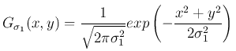
- 其次，两幅图像的高斯滤波表示为：  
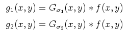
- 最后，将上面滤波得到的两幅图像g1和g2相减得到：  
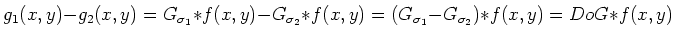
- 即DOG可以表示为：  
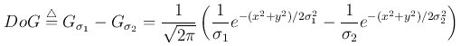
- 在具体图像处理中，就是将两幅图像在不同参数下的高斯滤波结果相减，得到DoG图。具体步骤如下所示:
- 第一步，计算不同参数下的DOG；
在图1,图2,图3，三种图像给了不同参数下的高斯滤波输出的效果，如下图所示：  
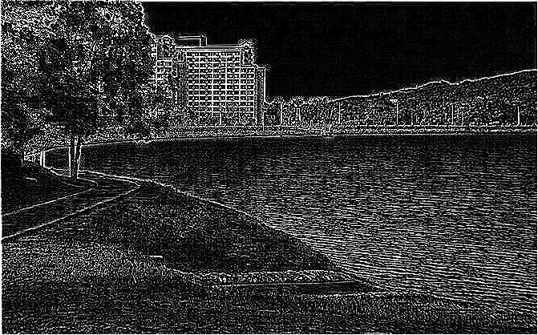

- 第二步，根据DOG,求角点。
- 根据理论：三维图中的最大值和最小值点是角点，如图所示：  
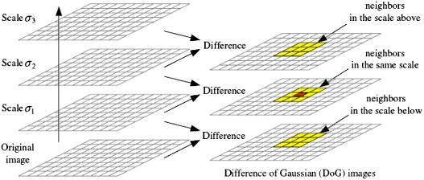
- 标记红色当前像素点，绿色的圈标记邻接像素点，用这个方式，最多检测相邻尺度的26个像素点。
- 如果它是所有邻接像素点的最大值或最小值点，则标记红色被标记为特征点，如此依次进行，则可以完成图像的特征点提取。
- 因此在第一步后，我们可以计算出的图1,图2,图3三个DOG图中求图2中是极值的点，如下图所示：  
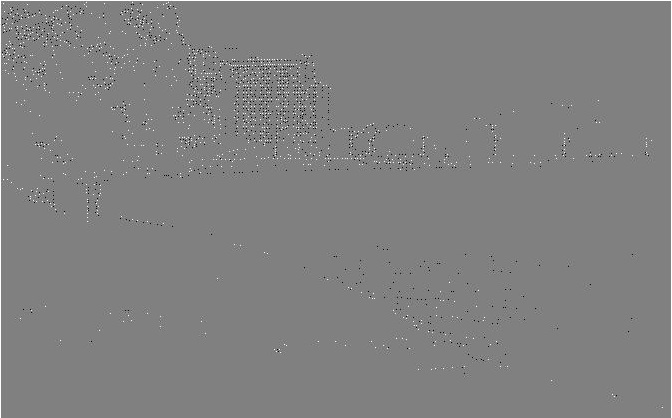
- 因此，原始图像上以显示的DOG角点检测结果，如下图所示：  
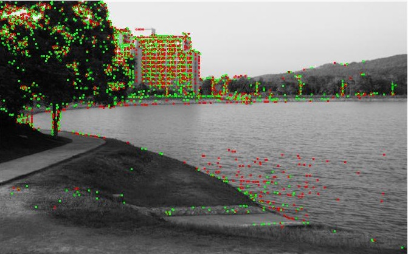
- DoG滤波核和LoG滤波核近似，但是LoG的效率更高。  
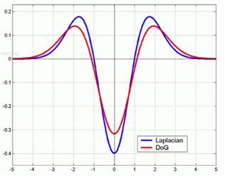
- 前面介绍的微分算子在近圆的斑点检测方面效果很好，但是这些检测算子被限定于只能检测圆形斑点，而且不能估计斑点的方向，因为LOG算子等都是中心对称的。
- 如果我们定义一种二维高斯核的变形，记它在X方向与Y方向上具有不同的方差，则这种算子可以用来检测带有方向的斑点。  
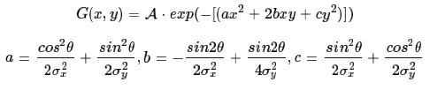
#### DoH
- DoH方法就是利用图像点二阶微分Hessian矩阵：  
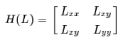
- 以及它的行列式的值DoH(Determinant of Hessian):  
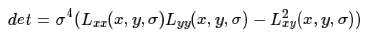
- Hessian矩阵行列式的值，同样也反映了图像局部的结构信息。与LoG相比，DoH对图像中的细长结构的斑点有较好的抑制作用。
- 无论是LoG还是DoH，它们对图像中的斑点进行检测，其步骤都可以分为以下两步：
1. 使用不同的σ生成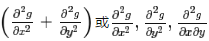模板，并对图像进行卷积运算；
2. 在图像的位置空间与尺度空间中搜索LoG与DoH响应的峰值。
#### SIFT
- 2004年，Lowe提高了高效的尺度不变特征变换算法（[SIFT](https://github.com/zhudingsuifeng/basicknowledge/blob/master/SIFT.md)）,利用原始图像与高斯核的卷积来建立尺度空间，并在高斯差分空间金字塔上提取出尺度不变性的特征点。
- 该算法具有一定的仿射不变性，视角不变性，旋转不变性和光照不变性，所以在图像特征提高方面得到了最广泛的应用。
- 该算法大概可以归纳为三步：1）高斯差分金字塔的构建；2）特征点的搜索；3）特征描述。
- 在第一步中，它用组与层的结构构建了一个具有线性关系的金字塔结构，让我们可以在连续的高斯核尺度上查找特征点。它比LoG高明的地方在于，它用一阶高斯差分来近似高斯的拉普拉斯核，大大减少了运算量。
- 在第二步的特征点搜索中，主要的关键步骤是极值点的插值，因为在离散的空间中，局部极值点可能并不是真正意义上的极值点，真正的极植点可以落在了离散点的缝隙中。所以要对这些缝隙位置进行插值，然后再求极值点的坐标位置。
- 第二步中另一关键环节是删除边缘效应的点，因为只忽略那些DoG响应不够的点是不够的，DoG的值会受到边缘的影响，那些边缘上的点，虽然不是斑点，但是它的DoG响应也很强。所以我们要把这部分点删除。我们利用横跨边缘的地方，在沿边缘方向与垂直边缘方向表现出极大与极小的主曲率这一特性。所以通过计算特征点处主曲率的比值即可以区分其是否在边缘上。这一点在理解上可以参见Harris角点的求法。
- 最后一步，即为特征点的特征描述。特征点的方向的求法是需要对特征点邻域内的点的梯度方向进行直方图统计，选取直方图中比重最大的方向为特征点的主方向，还可以选择一个辅方向。在计算特征矢量时，需要对局部图像进行沿主方向旋转，然后再进邻域内的梯度直方图统计（4x4x8）。
#### SURF
- 2006年，Bay和Ess等人基于SIFT算法的思路，提出了加速鲁棒特征（[SURF](https://github.com/zhudingsuifeng/basicknowledge/blob/master/SURF.md)）,该算法主要针对于SIFT算法速度太慢，计算量大的缺点，使用了近似Harr小波方法来提取特征点，这种方法就是基于Hessian行列式（DoH）的斑点特征检测方法。
- 通过在不同的尺度上利用积分图像可以有效地计算出近似Harr小波值，简化了二阶微分模板的构建，搞高了尺度空间的特征检测的效率。
- SURF算法在积分图像上使用了盒子滤波器对二阶微分模板进行了简化，从而构建了Hessian矩阵元素值，进而缩短了特征提取的时间，提高了效率。
- 其中SURF算法在每个尺度上对每个像素点进行检测，其近似构建的Hessian矩阵及其行列式的值分另为：  
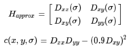
- 其中Dxx,Dxy和Dyy为利用盒子滤波器获得的近似卷积值。如果c(x,y,σ)大于设置的门限值，则判定该像素点为关键字。
- 然后与SIFT算法近似，在以关键点为中心的3×3×3像素邻域内进行非极大值抑制，最后通过对斑点特征进行插值运算，完成了SURF特征点的精确定位。
- 而SURF特征点的描述，则也是充分利用了积分图像，用两个方向上的Harr小波模板来计算梯度，然后用一个扇形对邻域内点的梯度方向进行统计，求得特征点的主方向。
### 角点检测
- 角点检测的方法也是极多的，其中具有代表性的算法是Harris算法与FAST算法。
#### Harris角点特征提取
- Harris角点检测是一种基于图像灰度的一阶导数矩阵检测方法。检测器的主要思想是局部自相似性/自相关性，即在某个局部窗口内图像块与在各个方向微小移动后的窗口内图像块的相似性。
- 如果在各个方向上移动这个特征的小窗口，窗口内区域的灰度发生了较大的变化，那么就认为在窗口内遇到了角点。如果这个特定的窗口在图像各个方向上移动时，窗口内图像的灰度没有发生变化，那么窗口内就不存在角点；
- 如果窗口在某一个方向移动时，窗口内图像的灰度发生了较大的变化，而在另一些方向上没有发生变化，那么，窗口内的图像可能就是一条直线的线段。  

- 对于图像I(x,y)，当在点(x,y)处平移(Δx,Δy)后的自相似性，可以通过自相关函数给出：  
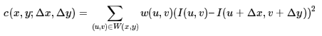
- 其中，W(x,y)是以点(x,y)为中心的窗口，w(u,v)为加权函数，它既可是常数，也可以是高斯加权函数。  

- 根据泰勒展开，对图像I(x,y)在平移(Δx,Δy)后进行一阶近似：  
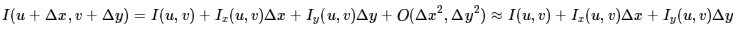
- 其中，Ix,Iy是图像I(x,y)的偏导数，这样的话，自相关函数则可以简化为：  
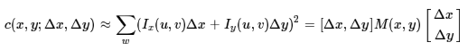
- 其中  
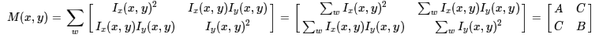
- 也就是说图像I(x,y)在点(x,y)处平移(Δx,Δy)后的自相关函数可以近似为二项函数：  
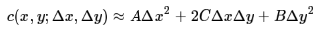
- 其中   
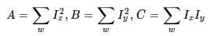
- 二次项函数本质上就是一个椭圆函数。椭圆的扁率和尺寸是由M(x,y)的特征值、λ1、λ2决定的，椭贺的方向是由M(x,y)的特征矢量决定的，如下图所示，椭圆方程为：  
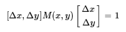

- 椭圆函数特征值与图像中的角点、直线（边缘）和平面之间的关系如下图所示。共可分为三种情况：
1. 图像中的直线。一个特征值大，另一个特征值小，λ1>>λ2或λ2>>λ1。自相关函数值在某一方向上大，在其他方向上小。
2. 图像中的平面。两个特征值都小，且近似相等；自相关函数数值在各个方向上都小。
3. 图像中的角点。两个特征值都大，且近似相等，自相关函数在所有方向都增大。  

- 根据二次项函数特征值的计算公式，我们可以求M(x,y)矩阵的特征值。但是Harris给出的角点差别方法并不需要计算具体的特征值，而是计算一个角点响应值R来判断角点。R的计算公式为:  
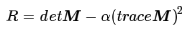
- 式中，detM为矩阵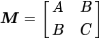的行列式；traceM为矩阵M的直迹；α经常为常数，取值范围为0.04~0.06。事实上，特征是隐含在detM和traceM中，因为，  
  detM=λ1λ2= AC-B^2
  traceM=λ1+λ2=A+C
- Harris角点算法实现
- 根据上述讨论，可以将Harris图像角点检测算法归纳如下，共分以下五步：
1. 计算图像I(x,y)在X和Y两个方向的梯度、Ix、Iy。  
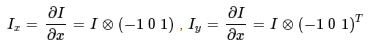
2. 计算图像两个方向梯度的乘积。  
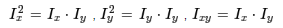
3. 使用高斯函数对、和(Ix)^2、(Iy)^2和Ixy进行高斯加权（取σ=1），生成矩阵M的元素、A、B和C。  

4. 计算每个像素的Harris响应值R，并对小于某一阈值t的R置为零。  
R={R:detM−α(traceM)^2<t}
5. 在3×3或5×5的邻域内进行非最大值抑制，局部最大值点即为图像中的角点。
- Harris角点性质
- 参数α对角点检测的影响
- 假设已经得到了矩阵M的特征值λ1≥λ2≥0，令λ2=kλ1,0≤k≤1。由特征值与矩阵M的直迹和行列式的关系可得：  
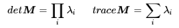
- 从而可以得到角点的响应  
  
  R=λ1λ2-α(λ1+λ2)^2=(λ1)^2(k-α(1+k)^2)
- 假设R≥0，则有：  
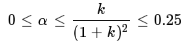
- 对于较小的k值，R≈λ^2(k−α),α<k。
#### 由此，可以得出这样的结论：增大α的值，将减小角点响应值R，降低角点检测的灵性，减少被检测角点的数量；减小α值，将增大角点响应值R，增加角点检测的灵敏性，增加被检测角点的数量。
- Harris角点检测算子对亮度和对比度的变化不敏感
- 这是因为在进行Harris角点检测时，使用了微分算子对图像进行微分运算，而微分运算对图像密度的拉升或收缩和对亮度的抬高或下降不敏感。换言之，对亮度和对比度的仿射变换并不改变Harris响应的极值点出现的位置，但是，由于阈值的选择，可能会影响角点检测的数量。  
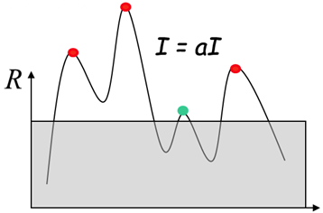
- Harris角点检测算子具有旋转不变性
- Harris角点检测算子使用的是角点附近的区域灰度二阶矩矩阵。而二阶矩矩阵可以表示成一个椭圆，椭圆的长短轴正是二阶矩矩阵特征值平方根的倒数。当特征椭圆转动时，特征值并不发生变化，所以判断角点响应值R也不发生变化，由此说明Harris角点检测算子具有旋转不变性。
- Harris角点检测算子不具有尺度不变性
- 如下图所示，当右图被缩小时，在检测窗口尺寸不变的前提下，在窗口内所包含图像的内容是完全不同的。左侧的图像可能被检测为边缘或曲线，而右侧的图像则可能被检测为一个角点。  

- 多尺度Harris角点
- 虽然Harris角点检测算子具有部分图像灰度变化的不变性和旋转不变性，但他不具有尺度不变性。
- 但是尺度不变性对图像特征来说至关重要。人们在使用肉眼识别物体时，不管物体远近，尺寸的变化都能认识物体，这是因为人的眼睛在辨识物体时具有较强的尺度不变性。
- 下面将Harris角点检测算子与高斯[尺度空间](https://github.com/zhudingsuifeng/basicknowledge/blob/master/ScaleSpace.md)表示相结合，使用Harris角点检测算子具有尺度的不变性。
- 仿照Harris角点检测中二阶矩的表示方法，使用M=μ(x,σI,σD)为尺度自适应的二阶矩：  
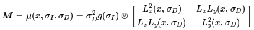
- 其中，g(σI)表示尺度为sigmaI的高斯卷积核，x表示图像的位置。与高斯测度空间类似，使用L(x)表示经过高斯平滑后的图像，符号(圆圈里面带个×)表示卷积，Lx(x,σD)和Ly(x,σD)表示对图像使用高斯g(σD)函数进行平滑后，在x或y方向取其微分的结果，即Lx=∂xL和Ly=∂yL。
- 通常将σI称为积分尺度，它是决定Harris角点当前尺度的变量，σD为微分尺度或局部尺度，它是决定角点附近微分值变化的变量。显然，积分尺度σI应该大于微分尺度σD。
- 多尺度Harris角点实现
- 首先，检测算法从预先定义的一组尺度中进行积分尺度搜索，这一组尺度定义为σ1…σn=σ0…knσ0.
- 一般情况下使用k=1.4。为了减少搜索的复杂性，对于微分尺度σD的选择，我们采用在积分尺度的基础上，乘以一个比例常数，即σD=sσI，一般取s=0.7。
- 这样，通常使用积分和微分的尺度，便可以生成μ(x,σI,σD)，再利用Harris角点判断准则，对角点进行搜索，具体可以分两步进行。
1. 与Harris角点搜索类似，对于给定的尺度空间值σD，进行如下角点响应值计算和判断：  
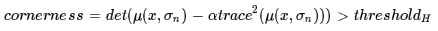
2. 对于满足1中条件的点，在点的8邻域内进行角点响应最大值搜索（即非最大值抑制）出在8邻域内角点响应最大值的点。对于每个尺度σn(1,2,…,n)都进行如上搜索。
- 由于位置空间的候选点并不一定在尺度空间上也能成为候选点，所以，我们还要在尺度空间上进行搜索，找到该点的所谓特征尺度值。搜索特征尺度值也分两步。
1. 对于位置空间搜索到的每个候选点，进行拉普拉斯响应计算，并满足其绝对值大于给定的阈值条件：  
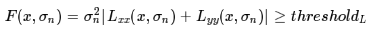
2. 与邻近的两个尺度空间的拉普拉斯响应值进行比较，使其满足：  
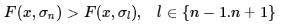
- 满足上述条件的尺度值就是该点的特征尺度值。这样，我们就找到了在位置空间和尺度空间都满足条件的Harris角点。
- 在上面描述的Harris角点具有光照不变性、旋转不变性、尺度不变性，但是严格意义上来说并不具备仿射不变性。Harris-Affine是一种新颖的检测仿射不变特征点的方法，可以处理明显的仿射变换，包括大尺度变化和明显的视角变化。Harris-Affine主要是依据了以下三个思路：
1. 特征点周围的二阶矩的计算对区域进行的归一化，具有仿射不变性；
2. 通过在尺度空间上归一化微分的局部极大值求解来精化对应尺度；
3. 自适应仿射Harris检测器能够精确定位牲点；
#### FAST角点特征提取
- 若某像素点与其周围领域内足够多的像素点处于不同的区域，则该像素点可能为角点。也就是某些属性与众不同，考虑灰度图像，即若该点的灰度值比其周围领域内足够多的像素点的灰度值大或者小，则该点可能为角点。
1. 从图片中选取一个像素P，下面我们将判断它是否是一个特征点。我们首先把它的亮度值设为Ip。
2. 设定一个合适的阈值t。
3. 考虑以该像素点为中心的一个半径等于3像素的离散化的Bresenham圆，这个圆的边界上有16个像素（如下图所示）。  

4. 现在，如果在这个大小为16个像素的圆上有n个连续的像素点，它们的像素值要么都比Ip+t大，要么都比Ip−t小，那么它就是一个角点。（如图中的白色虚线所示）。n的值可以设置为12或者9，实验证明选择9可能会有更好的效果。
- 上面的算法中，对于图像中的每一个点，我们都要去遍历其邻域圆上的16个点的像素，效率较低。
- 我们下面提出了一种高效的测试（high-speed test）来快速排除一大部分非角点的像素。
- 该方法仅仅检查在位置1，9，5和13四个位置的像素，首先检测位置1和位置9，如果它们都比阈值暗或比阈值亮，再检测位置5和位置13。
- 如果P是一个角点，那么上述四个像素点中至少有3个应该必须都大于Ip+t或者小于Ip−t，因为若是一个角点，超过四分之三圆的部分应该满足判断条件。如果不满足，那么p不可能是一个角点。
- 对于所有点做上面这一部分初步的检测后，符合条件的将成为候选的角点，我们再对候选的角点，做完整的测试，即检测圆上的所有点。
- 基于加速分割测试的FAST算法可以快速地提取出角点特征。该算法判断一个候选点p是否为角点，依据的是在一个像素点p为圆心，半径为3个像素的离散化Bresenllam圆周上，在给定阈值t的条件下，如果在圆周上有n个连续的像素灰度值大于I(p)+t或小于I(p)−t。
- 针对于上面的定义，我们可以用快速的方法来完成检测，而不用把圆周上的所有点都比较一遍。
- 首先比较上下左右四个点的像素值关系，至少要有3个点的像素灰度值大于I(p)+t或小于I(p)−t，则p为候选点，然后再进一步进行完整的判断。
- 为了加快算法的检测速度，可以使用机器学习ID3贪心算法来构建决策树。这里需要说明的是，在2010年Elmar和Gregory等人提出了自适应通用加速分割检测（AGAST）算法，通过把FAST算法中ID3决策树改造为二叉树，并能够根据当前处理的图像信息动态且高效地分配决策树，提高了算法的运算速度。
- 使用机器学习做一个角点分类器
1. 首先选取你进行角点提取的应用场景下很多张的测试图片。
2. 运行FAST角点检测算法来获取测试图片集上的所有角点特征。
3. 对于每个角点，我们把它邻域圆上的16个点存储下来保存在一个vector内，处理所有步骤2中得到的角点，并把它们存储在P中。
4. 对于图像上的点p,它周围邻域圆上位置为x,x∈{1…16}的点表示为p→x，可以用下面的判断公式将该点p→x分为3类：  
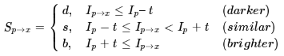
5. 设P为训练图像集中所有像素点的集合，我们任意16个位置中的一个位置x，可以把集合P分为三个部分Pd,Ps和Pb，其中Pd的定义如下，Ps和Pb的定义与其类似Pb={p∈P:Sp→x=b}换句话说，对于任意给定的位置x，它都可以把所有图像中的点分为三类，第一类Pd包括了所有位置x处的像素在阈值t下暗于中心像素，第二类Ps包括了所有位置x处的像素在阈值t下近似于中心像素，Pb包括了所有位置x处的像素在阈值t下亮于中心像素。
6. 定义一个新的布尔变量Kp，如果p是一个角点，那些Kp为真，否则为假。
7. 使用ID3算法（决策树分类器）来查询每一个子集。
8. 递归计算所有的子集直到Kp的熵为0;
9. 被创建的决策树就用于于其他图片的FAST检测。
- 非极大值抑制
- 从邻近的位置选取了多个特征点是另一个问题，我们可以使用Non-Maximal Suppression来解决。
1. 为每一个检测到的特征点计算它的响应大小（score function）V。这里V定义为点p和它周围16个像素点的绝对偏差的和。
2. 考虑两个相邻的特征点，并比较它们的V值。
3. V值较低的点将会被删除。
- 上面的算法效率实际上是很高的，但是有点一些缺点：
1. 当我们设置n<12时就不能使用快速算法来过滤非角点的点；
2. 检测出来的角点不是最优的，这是因为它的效率取决于问题的排序与角点的分布；
3. 对于角点分析的结果被丢弃了；
4. 多个特征点容易挤在一起。
- FAST算法比其他已知的角点检测算法要快很多倍，但是当图片中的噪点较多时，它的健壮性并不好，而且算法的效果还依赖于一个阈值t。而且FAST不产生多尺度特征而且FAST特征点没有方向信息，这样就会失去旋转不变性。
### 二进制字符串特征描述子
- 可以注意到在两种角点检测算法里，我们并没有像SIFT或SURF那样提到特征点的描述问题。事实上，特征点一旦检测出来，无论是斑点还是角点描述方法都是一样的，可以选用你认为最有效的特征描述子。
- 特征描述是实现图像匹配与图像搜索必不可少的步骤。到目前为止，人们研究了各种各样的特征描述子，比较有代表性的就是浮点型特征描述子和二进制字符串特征描述子。
- 像SIFT与SURF算法里的，用梯度统计直方图来描述的描述子都属于浮点型特征描述子。但它们计算起来，算法复杂，效率较低，所以后来就出现了许多新型的特征描述算法，如BRIEF。后来很多二进制串描述子ORB，BRISK，FREAK等都是在它上面的基础上的改进。
#### BRIEF算法
- BRIEF算法的主要思想是：在特征点周围邻域内选取若干个像素点对，通过对这些点对的灰度值比较，将比较的结果组合成一个二进制串字符串用来描述特征点。最后，使用汉明距离来计算在特征描述子是否匹配。
- BRIEF(Binary Robust Independent Elementary Features)基本原理
- 我们已经知道SIFT特征采用了128维的特征描述子，由于描述子用的浮点数，所以它将会占用512 bytes的空间。类似地，对于SURF特征，常见的是64维的描述子，它也将占用256bytes的空间。
- 如果一幅图像中有1000个特征点（不要惊讶，这是很正常的事），那么SIFT或SURF特征描述子将占用大量的内存空间，对于那些资源紧张的应用，尤其是嵌入式的应用，这样的特征描述子显然是不可行的。而且，越占有越大的空间，意味着越长的匹配时间。
- 但是实际上SFIT或SURF的特征描述子中，并不是所有维都在匹配中有着实质性的作用。我们可以用PCA、LDA等特征降维的方法来压缩特征描述子的维度。还有一些算法，例如LSH，将SIFT的特征描述子转换为一个二值的码串，然后这个码串用汉明距离进行特征点之间的匹配。
- 这种方法将大大提高特征之间的匹配，因为汉明距离的计算可以用异或操作然后计算二进制位数来实现，在现代计算机结构中很方便。下面来们提取一种二值码串的特征描述子。
- BRIEF应运而生，它提供了一种计算二值串的捷径，而并不需要去计算一个类似于SIFT的特征描述子。它需要先平滑图像，然后在特征点周围选择一个Patch，在这个Patch内通过一种选定的方法来挑选出来nd个点对。
- 然后对于每一个点对(p,q)，我们来比较这两个点的亮度值，如果I(p)>I(q)则这个点对生成了二值串中一个的值为1，如果I(p)<I(q)，则对应在二值串中的值为-1，否则为0。所有nd个点对，都进行比较之间，我们就生成了一个nd长的二进制串。
- 对于nd的选择，我们可以设置为128，256或512，这三种参数在OpenCV中都有提供，但是OpenCV中默认的参数是256，这种情况下，非匹配点的汉明距离呈现均值为128比特征的高斯分布。一旦维数选定了，我们就可以用汉明距离来匹配这些描述子了。
- 值得注意的是，对于BRIEF，它仅仅是一种特征描述符，它不提供提取特征点的方法。所以，如果你必须使一种特征点定位的方法，如FAST、SIFT、SURF等。这里，我们将使用CenSurE方法来提取关键点，对BRIEF来说，CenSurE的表现比SURF特征点稍好一些。
- 总体来说，BRIEF是一个效率很高的提取特征描述子的方法，同时，它有着很好的识别率。
- 点对选择
- 设我们在特征点的邻域块大小为S×S内选择nd个点对(p,q)，Calonder的实验中测试了5种采样方法：
1. 在图像块内平均采样；
2. p和q都符合(0,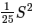)的高斯分布；
3. p符合(0,)的高斯分布，而q符合(0,)的高斯分布；
4. 在空间量化极坐标下的离散位置随机采样
5. 把p固定为(0,0)，q在周围平均采样
下面是上面5种采样方法的结果示意图。  
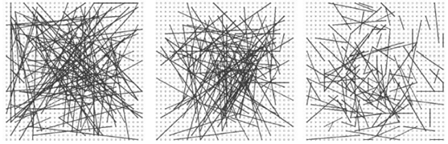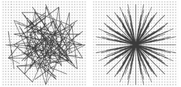
#### BRISK算法
- BRISK算法在特征点检测部分没有选用FAST特征点检测，而是选用了稳定性更强的AGAST算法。
- 在特征描述子的构建中，BRISK算法通过利用简单的像素灰度值比较，进而得到一个级联的二进制比特串来描述每个特征点，这一点上原理与BRIEF是一致的。
- BRISK算法里采用了邻域采样模式，即以特征点为圆心，构建多个不同半径的离散化Bresenham同心圆，然后再每一个同心圆上获得具有相同间距的N个采样点。  
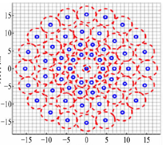
- 由于这种邻域采样模式在采样时会产生图像灰度混叠的影响，所以BRISK算法首先对图像进行了高斯平滑图像。并且使用的高斯函数标准差σi与各自同心圆上点间距成正比。
- 假设在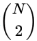个采样点中任意选取一对采样点(pi,pj)，其平滑后的灰度值分别为I(pi,σi)和I(pj,σj)，则两点间的局部梯度为：  
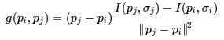
- 假设把所有采样点对构成的集合记为A，则  

- 那么短距离采样点对构成的集合S以及长距离采样点构成的集合L分别为：  

- 其中，通常设置距离阈值为δmin=9.75δ,δmax=13.67δ，其中δ为特征点的尺度。
- 由于长距离采样点对含有更多的特征点角度信息，且局部梯度相互抵消，所以可以在集合L中计算出特征点的特征模式方向为：  

- 然后将采样模式围绕特征点旋转角度α=arctan2(gy,gx)，进而特征描述子具有了旋转不变性。
- 最后，在旋转后的短距离采样点集合S内，对所有的特征点对行像素灰度值比较，最终形成512比特的二进制字符串描述子。
#### ORB算法
- ORB(Oriented FAST and Rotated BRIEF)是对FAST特征点与BREIF特征描述子的一种结合与改进。
- 首先，它利用FAST特征点检测的方法来检测特征点，然后利用Harris角点的度量方法，从FAST特征点从挑选出Harris角点响应值最大的N个特征点。其中Harris角点的响应函数定义为：  

- 旋转不变性
- 我们知道FAST特征点是没有尺度不变性的，所以我们可以通过构建高斯金字塔，然后在每一层金字塔图像上检测角点，来实现尺度不变性。
- 那么，对于局部不变性，我们还差一个问题没有解决，就是FAST特征点不具有方向，ORB的论文中提出了一种利用灰度质心法来解决这个问题，灰度质心法假设角点的灰度与质心之间存在一个偏移，这个向量可以用于表示一个方向。对于任意一个特征点p来说，我们定义p的邻域像素的矩为：  

- 其中I(x,y)为点(x,y)处的灰度值。那么我们可以得到图像的质心为：  

- 那么特征点与质心的夹角定义为FAST特征点的方向：θ=arctan(m01,m10)
- 为了提高方法的旋转不变性，需要确保x和y在半径为r的圆形区域内，即x,y∈[−r,r]，r等于邻域半径。
- 特征点描述
- ORB选择了BRIEF作为特征描述方法，但是我们知道BRIEF是没有旋转不变性的，所以我们需要给BRIEF加上旋转不变性，把这种方法称为“Steer BREIF”。
- 对于任何一个特征点来说，它的BRIEF描述子是一个长度为n的二值码串，这个二值串是由特征点周围n个点对（2n个点）生成的，现在我们将这2n个点(xi,yi),i=1,2,……,2n组成一个矩阵S  

- Calonder建议为每个块的旋转和投影集合分别计算BRIEF描述子，但代价昂贵。ORB中采用了一个更有效的方法：使用邻域方向θ和对应的旋转矩阵Rθ，构建S的一个校正版本Sθ  

- 其中  

- 而θ即我们在前面为特征点求得的主方向。
- 实际上，我们可以把角度离散化，即把360度分为12份，每一份是30度，然后我们对这个12个角度分别求得一个Sθ，这样我们就创建了一个查找表，对于每一个θ，我们只需查表即可快速得到它的点对的集合Sθ。
- 解决描述子的区分性
BRIEF令人惊喜的特性之一是：对于n维的二值串的每个比特征位，所有特征点在该位上的值都满足一个均值接近于0.5，而方差很大的高斯分布。
- 方差越大，说明区分性越强，那么不同特征点的描述子就表现出来越大差异性，对匹配来说不容易误配。
- 但是当我们把BRIEF沿着特征点的方向调整为Steered BRIEF时，均值就漂移到一个更加分散式的模式。可以理解为有方向性的角点关键点对二值串则展现了一个更加均衡的表现。
- 而且论文中提到经过PCA对各个特征向量进行分析，得知Steered BRIEF的方差很小，判别性小，各个成分之间相关性较大。
- 为了减少Steered BRIEF方差的亏损，并减少二进制码串之间的相关性，ORB使用了一种学习的方法来选择一个较小的点对集合。方法如下：
- 首先建立一个大约300k关键点的测试集，这些关键点来自于PASCAL2006集中的图像。
- 对于这300k个关键点中的每一个特征点，考虑它的31×31的邻域，我们将在这个邻域内找一些点对。
- 不同于BRIEF中要先对这个Patch内的点做平滑，再用以Patch中心为原点的高斯分布选择点对的方法。ORB为了去除某些噪声点的干扰，选择了一个5×5大小的区域的平均灰度来代替原来一个单点的灰度，这里5×5区域内图像平均灰度的计算可以用积分图的方法。
- 我们知道31×31的Patch里共有N=(31−5+1)×(31−5+1)个这种子窗口，那么我们要N个子窗口中选择2个子窗口的话，共有种方法。所以，对于300k中的每一个特征点，我们都可以从它的31×31大小的邻域中提取出一个很长的二进制串，长度为M=，表示为binArray=[p1,p2,……,pM],pi∈{0,1}
- 那么当300k个关键点全部进行上面的提取之后，我们就得到了一个300k×M的矩阵，矩阵中的每个元素值为0或1。
- 对该矩阵的每个列向量，也就是每个点对在300k个特征点上的测试结果，计算其均值。把所有的列向量按均值进行重新排序。排好后，组成了一个向量T，T的每一个元素都是一个列向量。
- 进行贪婪搜索：从T中把排在第一的那个列放到R中，T中就没有这个点对的测试结果了。然后把T中的排下一个的列与R中的所有元素比较，计算它们的相关性，如果相关超过了某一事先设定好的阈值，就扔了它，否则就把它放到R里面。
- 重复上面的步骤，只到R中有256个列向量为止。如果把T全找完也，也没有找到256个，那么，可以把相关的阈值调高一些，再重试一遍。
- 这样，我们就得到了256个点对。上面这个过程我们称它为rBRIEF。
#### FREAK算法
- Fast Retina KeyPoint，即快速视网膜关键点。
- 根据视网膜原理进行点对采样，中间密集一些，离中心越远越稀疏。并且由粗到精构建描述子，穷举贪婪搜索找相关性小的。42个感受野，一千对点的组合，找前512个即可。这512个分成4组，前128对相关性更小，可以代表粗的信息，后面越来越精。匹配的时候可以先看前16bytes，即代表精信息的部分，如果距离小于某个阈值，再继续，否则就不用往下看了。
### 图像匹配
- 图像匹配的研究目标是精确判断两幅图像之间的相似性。图像之间的相似性的定义又随着不同的应用需求而改变。
- 例如，**在物体检索系统中（找出含有亚伯拉罕·林肯的脸的图像），我们认为同一物体的不同图像是相近的**。
- 而在物体类别检索系统中（找出含有人脸的图像），我们则认为相同类的物体之间是相近的。
- **这里局部特征点的应用主要表现在第一种相似性上**，也就是说我们需要设计某种图像匹配算法来判断两幅图像是否是对同一物体或场景所成的图像。理想的图像匹配算法应该认为两幅同一物体的图像之间相似度很高，而两幅不同物体的图像之间相似度很低，如下图所示。  

- 由于成像时光照，环境，角度的不一致，我们获取的同一物体的图像是存在差异的，如同上图中的两辆小车的图像一样，角度不同，成像就不同。我们直接利用图像进行比较是无法进行判断小车是否为同一类的。必须进行特征点的提取，再对特征点进行匹配。
- 图像会存在哪些变换呢？一般来说包括了光照变化与几何变化，光照变化表现是图像上是全局或局部颜色的变化，而几何变化种类就比较多了，可以是平移、旋转、尺度、仿射、投影变换等等。所以我们在研究局部特征点时才要求特征点对这些变化具有稳定性，同时要有很强的独特性，可以让图像与其他类的图像区分性强，即类内距离小而类间距离大。