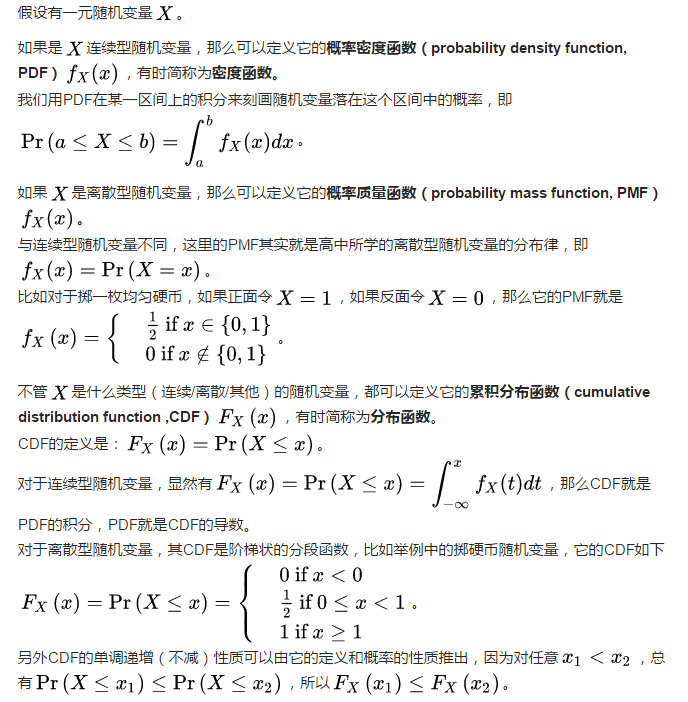

## 图像滤波、卷积、模糊
- 滤波：是从信号中获取需要的频率成分或者去除掉不需要的频率成分。
- 图像滤波，即在尽量保留图像细节特征的条件下对目标图像的噪声进行抑制，是图像预处理中不可缺少的操作，其处理效果好坏将直接影响到后续图像处理和分析的有效性和可靠性。
- 滤波是图像处理中的一种常用方法，有各种各样的滤波器，所得到的效果和使用的目的都各有不同。
- 滤波的目的有两个：一是抽出对象的特征作为图像识别的特征模式；另一个是为适应图像处理的要求，消除图像数字化时所混入的噪声。
- 对滤波处理的要求有两条：一是不能损坏图像的轮廓及边缘等重要信息；二是使图像清晰视觉效果好。
- 图像的滤波方法很多，主要可以分为[空域滤波](https://github.com/zhudingsuifeng/basicknowledge/blob/master/SpatialDomainFiltering.md)和[频域滤波](https://github.com/zhudingsuifeng/basicknowledge/blob/master/FrequencyDomainFiltering.md)两大类。
- 进行滤波就是对于大矩阵中的每个像素，计算他周围像素和滤波器矩阵对应位置元素的乘积，然后把结果相加到一起，最终得到的值就做为该像素的新值，这样就完成了一次滤波。
#### 滤波器
- 用于滤波的是一个滤波器小矩阵(也叫卷积核)，滤波器小矩阵一般是个方阵，也就是行数和列数相同。
- 滤波器是能过滤某些特定频段，留下需要信号的部件，比如低通滤波器(只留下低频分量)、高通滤波器(只留下高频分量)、带通滤波器(只留下特定范围内的分量)。
- 模板：矩阵方块，其数学含义是一种卷积运算。      
- 卷积核：卷积时使用到的权用一个矩阵表示，该矩阵是一个权矩阵。
- 滤波器、掩膜、核、模板、窗口是一个意思，本质是一个方阵矩阵。
#### 对于滤波器，也有一定的规则要求：
- 滤波器的大小应该是奇数，这样它才有一个中心，例如3x3，5x5或者7x7。有中心了，也有了半径的称呼，例如5x5大小的核的半径就是2。
- 滤波器矩阵所有的元素之和应该要等于1，这是为了保证滤波前后图像的亮度保持不变。当然了，这不是硬性要求了。
- 如果滤波器矩阵所有元素之和大于1，那么滤波后的图像就会比原图像更亮，反之，如果小于1，那么得到的图像就会变暗。如果和为0，图像不会变黑，但也会非常暗。
- 对于滤波后的结构，可能会出现负数或者大于255的数值。对这种情况，我们将他们直接截断到0和255之间即可。对于负数，也可以取绝对值。
#### 频率域法的处理是在图像的某种变换域内，对图像的变换系数值进行运算，然后通过逆变换获得增强图像。是一种间接的图像滤波方法。
#### 空间预滤波方法是一类直接的滤波方法，它在处理图像时直接对图像灰度做运算。
- 频率域滤波：是将图像从空间或时间域转换到频率域，再利用变换系数反映某些图像特征的性质进行图像滤波的方法。傅立叶变换是一种常用的变换。
- 在傅立叶变换域，频谱的直流分量正比于图像的平均亮度，噪声对应于频率较高的区域，图像实体位于频率较低的区域。图像在变换具有的这些内在特性可被用于图像滤波。
- 可以构造一个低通滤波器，使低频分量顺利通过而有效地阻于高频分量，即可滤除图像的噪声，再经过反变换来取得平滑的图像。
#### 常用的平面空间域滤波法有两类:  
- 一类是拟合图像的方法，包括n阶多项式拟合、离散正交多项式拟合、二次曲面拟合等多种方法; 
- 另一类是平滑图像的方法，包括领域平均法、中值滤波法、梯度倒数加权法、选择式掩模法等。
- 要构造一种有效抑制噪声的滤波器必须考虑两个基本问题：能有效地去除目标和背景中的噪声;同时，能很好地保护图像目标的形状、大小及特定的几何和拓扑结构特征 。
#### 按频率高低可以分为高通滤波、低通滤波。
- 高通滤波：边缘提取与增强。边缘区域的灰度变化加大，也就是频率较高。所以对于高通滤波，边缘部分将被保留，非边缘部分将被过滤。
- 低通滤波：边缘平滑，边缘区域将被平滑过渡。
- 高斯滤波是一种线性平滑滤波，即低通滤波，适用于消除高斯噪声，广泛应用于图像处理的减噪过程。
#### 线性与非线性滤波
- 线性滤波：线性滤波器的原始数据与滤波结果是一种算术运算，即用加减乘除运算实现，如(1)均值滤波器（模板内像素灰度值的平均值）、(2)高斯滤波器（高斯加权平均值）等。由于线性滤波器是算术运算，有固定的模板，因此滤波器的转移函数是可以确定并且是唯一的（转移函数即模板的傅里叶变换）。
- 传统线性滤波技术，在消除噪声的同时，总会以某种方式模糊图像细节进而导致图像线性特征的定位精度及特征的可抽取性降低。
- 非线性滤波：非线性滤波器的原始数据与滤波结果是一种逻辑关系，即用逻辑运算实现，如最大值滤波器、最小值滤波器、中值滤波器等，是通过比较一定邻域内的灰度值大小来实现的，没有固定的模板，因而也就没有特定的转移函数（因为没有模板作傅里叶变换），另外，膨胀和腐蚀也是通过最大值、最小值滤波器实现的。
- 非线性滤波器是基于对输入信号的一种非线性映射关系，常可以把某一特定的噪声近似的映射为零而保留信号的重要特征，因而其在一定程度上能克服线性滤波器的不足之处。
#### 五种常见的非线性滤波算子，这五种滤波算子对不同的图像都会有不同的作用，最常用的是中值滤波，因为它的效果最好且信息损失的最少。
- 极大值滤波就是选取像素点领域的最大值作为改点的像素值，有效率去了灰度值比较低的噪声，也可作为形态学里面的膨胀操作。
- 极小值滤波（与极大值滤波相反）
- 中点滤波常用于去除图像中的短尾噪声，例如高斯噪声和均匀分布噪声。终点滤波器的输出时给定窗口内灰度的极大值和极小值的平均值。
- 中值滤波可以消除图像中的长尾噪声，例如负指数噪声和椒盐噪声。在消除噪声时，中值滤波对图像噪声的模糊极小（受模板大小的影响），中值滤波实质上是用模板内所包括像素灰度的中值来取代模板中心像素的灰度。中值滤波在消除图像内椒盐噪声和保持图像的空域细节方面，其性能优于均值滤波。
- 加权中值滤波是在中值滤波的基础上加以改进，其性能在一定程度上优于中值滤波。
- 线性滤波器所能是实现的就是乘积求和操作。
- 均值滤波在去噪声的同时会有如下缺点：边界模糊效应明显、细节丢失比较严重。
- 中值滤波在边界的保存方面优于均值滤波，是经常使用的一种滤波器，但是在模板逐渐变大时，依然会存在一定的边界模糊中值滤波对处理椒盐噪声非常有效，或者称为脉冲噪声。
#### 噪声
- 由于成像系统、传输介质和记录设备等的不完善，数字图像在其形成、传输记录过程中往往会受到多种噪声的污染。
- 另外，在图像处理的某些环节当输入的像对象并不如预想时也会在结果图像中引入噪声。这些噪声在图像上常表现为一引起较强视觉效果的孤立像素点或像素块。
- 一般，噪声信号与要研究的对象不相关它以无用的信息形式出现，扰乱图像的可观测信息。
- 对于数字图像信号，噪声表为或大或小的极值，这些极值通过加减作用于图像像素的真实灰度值上，对图像造成亮、暗点干扰，极大降低了图像质量，影响图像复原、分割、特征提取、图像识别等后继工作的进行。
- 高斯噪声：是指噪声服从高斯分布，及某个强度的噪声点个数最多，离这个强度远远噪声点个数越少，且这个规律服从高斯分布。高斯噪声是一种加性噪声，即噪声直接加到原图像上，因此可以用线性滤波起滤掉。
- 椒盐噪声：类似把椒盐撒在图像上，因此得名，是一种在图像上出现很多白点或黑点的噪声，如电视里的雪花噪声等。椒盐噪声可以认为是一种逻辑噪声，用线性滤波器滤除的结果不好，一般采用中值滤波器滤波可以得到较好的结果。
- 图像平滑(image smoothing)：压制、弱化或消除图像中的细节、突变、边缘和噪声，就是图像平滑化。实际上就是低通滤波。
- 图像平滑是对图像做低通滤波，可在空间域或频率域实现。空间域图像平滑方法主要用低通卷积滤波、中值滤波等；频率域图像平滑常用的低通滤波器有低通梯形滤波器、低通高斯滤波器、低通指数滤波器、巴特沃斯低通滤波器。
- 图像卷积：一种实现手段，不管是滤波还是别的什么，可以说是数学在图像处理的一种延伸。
- 图像滤波：一种图像处理方法，来实现不同目的。
- 卷积是各种图像变换的基础，一个特殊卷积所实现的功能是由其卷积核(模板)的形势决定的。高斯变换就是用高斯函数对图像进行卷积。
- 平滑处理：平滑类型：简单模糊（对邻域求和，并缩放），简单无缩放变换的模糊（对邻域求和），中值模糊（中值滤波），高斯模糊（高斯卷积），双边模糊（双线性滤波）。
- 膨胀和腐蚀。
- 图像金字塔
- 拉普拉斯变换、canny算子（求导数）
#### 卷积
- 卷积是滤波的方法之一。
- 卷积运算，其实就是可看作是加权求和的过程，使用到的图像区域中的每个像素分别与卷积核(权矩阵)的每个元素对应相乘，所有乘积之和作为区域中心像素的新值。  
  
- 对图像大矩阵和滤波小矩阵对应位置元素相乘在求和的操作就叫卷积(convolution)或协相关(correlation).  

- 协相关(correlation)和卷积(convolution)很类似，两者唯一的区别就是卷积在计算前需要翻转卷积核，而协相关则不需要翻转。
- 卷积核其实就是一个大小固定、由数值参数构成的数组，数组的参考点通常位于数组的中心，数组的大小称为核支撑。单就技术而言，核支撑实际上仅仅由核数组的非0部分组成。或者，像其他说法，卷积核就是所谓的模板。
#### 卷积核翻转
- 图像卷积计算，需要先翻转卷积核，也就是绕卷积核中心旋转180度，也可以分别沿两条对角线翻转两次，还可以同时翻转行和列，这3种处理都可以得到同样的结果。
- 卷积和协相关的差别是，卷积需要先对滤波矩阵进行180度的翻转，但如果矩阵是对称的，那么两者就没有什么差别了。
#### 区别与联系如下
- 模糊是滤波的一种效果。
- 滤波是一种方法或者工具，而平滑和去噪是目的或者对工具的应用。
- 滤波，根据你要去掉哪部分频率分量，可以分为低通，高通，带通和带阻滤波。
- 平滑，就是去掉信号中没有必要的快速起伏的成分，让信号看起来更光滑。平滑是滤波的其中一种表现，通常是使用低通滤波器对图像进行滤波所得到的效果。平滑的本质是低通滤波。
- 在图像处理领域，平滑是对空域提出的一种要求，而非频域，它的目的是为了使图像的边缘看上去不那么锐利，与锐化的结果相反，为了实现平滑，我们就要对图像进行滤波，可以通过空域技术进行滤波，比如采用领域均值模板运算，也可以采用频域技术，比如通过低通滤波器。
- 去噪就顾名思义是去除噪声，在简单的图像处理中，对图像作平滑处理是去噪的一种方式，而事实上去噪的方法还有很多。
- 去噪的目的是为了去除信号中不要的成分，可以是图像中的噪点，可以是通信信号中的白噪声，而去噪也需要通过滤波。
- 滤波是手段，平滑是效果、去噪是目的。三者之间虽然有很大的交集，但不能称之为一样的，
- 滤波是从信号中获取需要的频率成分或者去除掉不需要的频率成分。
- 滤波可以实现平滑的效果，如高斯滤波，但也可以用来增强图像、突出边缘，比如拉普拉斯滤波、张量扩散、引导图像滤波。
- 平滑效果的获取，可以通过滤波，也可以在频域对高频分量衰减实现，也不一定是用来去噪，也可能是用来磨皮、产生朦胧美感。
- 平滑：在图像处理中，平滑会使得图像模糊。平滑是一种时域手段（图像处理时域也叫空域，因为是二维的），在频域下就是低通滤波了。
- 去噪可以用空域滤波的形式实现，也可以用其他变换域阈值化的方式实现。一个好的去噪方法应该是能够很好保持边缘、细节、纹理，使其不被平滑掉的。
- 总而言之，滤波是信号处理的最基本步骤，任何对信号的操作都可以称之为滤波，而平滑和降噪算是滤波的一种手段
#### 空域和频域
- 空间域：（spatial domain）也叫空域，即所说的像素域，在空域的处理就是在像素级的处理，如在像素级的图像叠加。
- 通过傅立叶变换后，得到的是图像的频谱。表示图像的能量梯度。
- 频率域：（frequency domain。）任何一个波形都可以分解用多个正弦波之和。
- 每个正弦波都有自己的频率和振幅。所以任意一个波形信号有自己的频率和振幅的集合。频率域就是空间域经过傅立叶变换的信号
- 时域（时间域）——自变量是时间,即横轴是时间,纵轴是信号的变化。其动态信号x（t）是描述信号在不同时刻取值的函数。
- 频域（频率域）——自变量是频率,即横轴是频率,纵轴是该频率信号的幅度,也就是通常说的频谱图。频谱图描述了信号的频率结构及频率与该频率信号幅度的关系。
- 时域卷积=频域相乘，即两个时域信号卷积的结果的频谱，是两个时域频谱对应频率乘积的结果。
#### 概率密度函数(probability density function,PDF)  
