### In the mathematical field of graph theory,the Laplacian matrix,sometimes called admittance matrix,Kirchhoff matrix or discrete Laplcian,is a matrix representation of graph.
### The Laplacian matrix can be used to find many useful properties of a graph.Together with Kirchhoff's theorem,it can be used to calculate the number of spanning trees for a given graph.
### The sparsest cut of a graph can be approximated through the second smallest eigenvalue of its Laplacian by Cheeger's inequality.
#### Laplacian matrix for simple graphs
- Given a simple graph G with n vertices, its Laplacian matrix 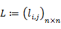 is defined as :L=D-A,
- where D is the degree matrix and A is the adjacency matrix of the graph.Since G is a simple graph, A only contains 1s or 0s and its diagonal elemants are all 0.
- In the case of directed graphs,either the indegree or outdegree might be used , depending on the application.The elements of L are given by   

- where deg(vi) is the degree of the vertex i.
- Symmetric normalized Laplacian
- The symmetric normalized Laplacian matrix is defined as:  
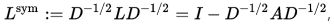
- The elements of L are given by  

#### Random walk normalized Laplacian
- The random-walk normalized Laplacian matrix is defined as :  
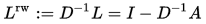
- The elements of L are given by  
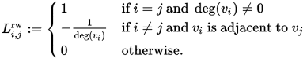
### Example
- Here is a simple example of a labeled ,undirected graph and its Laplacian matrix.
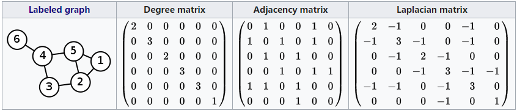
### Properties
- For an (undirected) graph G and its Laplacian matrix L with eigenvalues 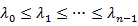:
- L is symmetric.
- L is positive-semidefinite(that is 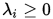for all i).This is verified in the incidence matrix section(below).This can also be seen from the fact that the Laplacian is symmetric and diagonally dominant.
- L is an M-matrix(its off-diagonal entries are nopositive,yet the realparts of its eigenvalues are nonnegarive).
- Every row sum and column sum of L is zero.Indeed,in the sum ,the degree of the vertex is summed with a "-1" for each nighbor.
- In sonsequence,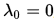,because the vector 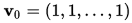 satisfies 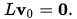
- The number of connected components in the graph is the dimension of the nullspace of the Laplacian and the algebraic multiplicity of the 0 eigenvalue.
- The smallest non-zero eigenvalue of L is called the spactral gap.
- The second smallest eigenvalue of L(could be zero) is the algebraic connectivity (or Fiedler value) of G and approximates the sparsest cut of a graph.
- The Laplacian is an operator on the n-dimensional vector space of functions f:V->R,where Vis the vertex set of G ,and n=|V|.
- Where G is k-regular,the normalized Laplacian is :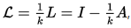 where A is the adjacency matrix and * is an identity matrix.
- For a graph with multiple connected components,L is a block diagonal matrix ,where each block is the respective Laplacian matrix for each component,possibly after reordering the vertices(i.e. L is permutation-similar to a block diagonal matrix).
- Laplacian matrix is singular.
- 对于图G和它的拉普拉斯矩阵L,矩阵的特征值是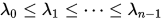,L是半正定的,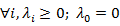.
- 拉普拉斯矩阵的特征值中0的数目是图的联通分量的个数。
- 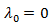因为每一个拉普拉斯矩阵有一个特征向量[1,1,1,....,1]，对每一行，加上相应的节点度到-1的邻接点，由矩阵定义从而得到特征值0.
- 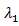也被称为代数联通度(algebraic connectivity).
- 最小的非0特征值乘坐谱间隔(spectral gap)或费德勒值(Fiedler value)。
### 拉普拉斯重要性质推导
- 不失一般性，vi与vj的权重不再是1而是wij,f(vi)表示节点vi的函数，对应实际应用它可以是一个概率值、一个像素值等等。
- 对任意向量f,  
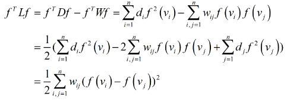
- 这样一来，拉普拉斯矩阵的意义就比较明显了，它是一种基于欧氏距离的测度，如果wij=1,上式对应就是所有数据点的距离之和，同时，D对应二次项，W对应不同一次项相乘。
### 瑞利熵
- 提到拉普拉斯矩阵，就不能不提瑞利熵。
#### 普通瑞利熵
  
- 因为对h幅值进行调整不会影响R的取值，同时也不会改变h向量的方向，对于一般优化问题(以max为例)：  
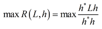
- 可以转化为拉格朗日乘子问题：  
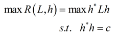
- c为常数，即：  
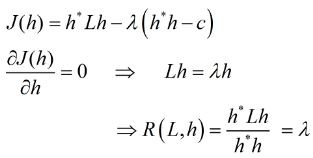
- 可以看出：
- R的最大值就是L最大特征值，R的最小值就是L最小特征值。
- h的解，就是L对应的特征向量。
- PCA就是瑞利熵理论的一个应用。谱聚类(Spectral clustering)中,RatioCut算法也是瑞利熵的一个应用。
#### 泛化瑞利熵
- 对于  

- 可以看到分子式一般形式，而分母是h*Dh在D取单位阵时的特殊情况，将其一般化：  
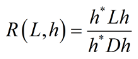
- 同理可得：  
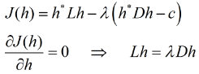
- 适当变形：  
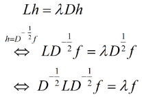
- 这个时候表达式就是：  
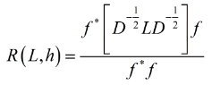
- LDA是泛化瑞利熵的一个应用，谱聚类(spectral clustering)中,NCut算法也是泛化瑞利熵的一个应用。