## SIFT(Scale-Invariant Feature Transform)尺度不变特征变换
- SIFT算法的实质是在不同的尺度空间上查找关键点(特征点)，并计算出关键点的方向。
#### SIFT算法的特点：
1. SIFT特征是图像的局部特征，其对旋转、尺度缩放、亮度变化保持不变性，对视角变化、仿射变换、噪声也保持一定程度的稳定性；
2. 独特性（Distinctiveness）好，信息量丰富，适用于在海量特征数据库中进行快速、准确的匹配；
3. 多量性，即使少数的几个物体也可以产生大量的SIFT特征向量；
4. 高速性，经优化的SIFT匹配算法甚至可以达到实时的要求；
5. 可扩展性，可以很方便的与其他形式的特征向量进行联合。
#### SIFT算法可以解决的问题：
1. 目标的旋转、缩放、平移（RST）
2. 图像仿射/投影变换（视点viewpoint）
3. 光照影响（illumination）
4. 目标遮挡（occlusion）
5. 杂物场景（clutter）
6. 噪声
#### Lowe将SIFT算法分解为如下四步：
1. 尺度空间极值检测(Scale-space Extrema Detection)：搜索所有尺度上的图像位置。通过高斯微分函数来识别潜在的对于尺度和旋转不变的兴趣点。它用组与层的结构构建了一个具有线性关系的金字塔结构，让我们可以在连续的高斯核尺度上查找特征点。它比LoG高明的地方在于，它用一阶高斯差分来近似高斯的拉普拉斯核，大大减少了运算量。
2. 关键点定位(Keypoint Localization)：在每个候选的位置上，通过一个拟合精细的模型来确定位置和尺度。关键点的选择依据于它们的稳定程度。特征点搜索中，主要的关键步骤是极值点的插值，因为在离散的空间中，局部极值点可能并不是真正意义上的极值点，真正的极植点可以落在了离散点的缝隙中。所以要对这些缝隙位置进行插值，然后再求极值点的坐标位置。
3. 方向确定(Orientation Assignment)：基于图像局部的梯度方向，分配给每个关键点位置一个或多个方向。所有后面的对图像数据的操作都相对于关键点的方向、尺度和位置进行变换，从而提供对于这些变换的不变性。
4. 关键点描述(Keypoint Descriptor)：在每个关键点周围的邻域内，在选定的尺度上测量图像局部的梯度。这些梯度被变换成一种表示，这种表示允许比较大的局部形状的变形和光照变化。
### SIFT算法中一些符号的说明
- I(x,y)表示原图像。
- G(x,y,σ)表示高斯滤波器，其中G(x,y,σ)=1/(2πσ^2)*exp(−(x2+y2)/2σ2)。
- (x，y)是空间坐标，是尺度坐标。σ大小决定图像的平滑程度，大尺度对应图像的概貌特征，小尺度对应图像的细节特征。大的σ值对应粗糙尺度(低分辨率)，反之，对应精细尺度(高分辨率)。为了有效的在尺度空间检测到稳定的关键点，提出了高斯差分尺度空间（DOG scale-space）。利用不同尺度的高斯差分核与图像卷积生成。
- L(x,y,σ)表示由一个高斯滤波器与原图像卷积而生成的图像，即L(x,y,σ)=G(x,y,σ)*I(x,y)。一系列的σi，则可以生成一系列的L(x,y,σi)图像，此时我们把这一系列的L(x,y,σ)图像称为原图像的一个[尺度空间](https://github.com/zhudingsuifeng/basicknowledge/blob/master/ScaleSpace.md)表示。
- DOG表示高斯差分（Difference of Gaussians），也可以表示为D(x,y,σ)，其中D(x,y,σ)=(G(x,y,kσ)–G(x,y,σ))*I(x,y)=L(x,y,kσ)–L(x,y,σ)。
- 上面特别值得注意的是尺度为σ的高斯差分图像由于尺度为kσ与尺度为σ的L图像生成的。k为两相邻尺度空间倍数的常数。
- O：高斯金字塔的组数（Octave），其中值得注意的是在实际构建中，第一组的索引可以为0也可以为-1，这个在后面解释原理。
- S：高斯金字塔每一组的层数。在实际最开始构建尺度空间图像，即L图像的时候，构建了S+3层，一定要把这个S+3与S区分开，为什么是S+3后面分析。  

- 其中，组内(Octave)图像的尺寸相通，组间更高组图像是低层图像大小的1/4.
### 构建高斯差分金字塔
- 高斯卷积核是实现尺度变换的唯一变换核，并且是唯一的线性核。
- 二维高斯卷积示意图：  
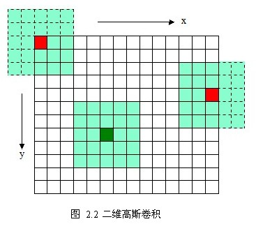
- 二维高斯模糊效果图：  
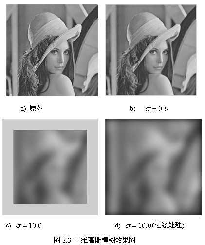
- 如上图所示，使用二维的高斯模板达到了模糊图像的目的，但是会因模板矩阵的关系而造成边缘图像缺失(b,c)，σ越大，缺失像素越多,丢弃模板会造成黑边(d)。
- 更重要的是当高斯模板变大时，高斯模板(高斯核)和卷积运算量将大幅度提高。
- 根据高斯函数的可分离性，可对二维高斯模糊函数进行改进。
高斯函数的可分离性是指使用二维矩阵变换得到的效果也可以通过在水平方向进行一维高斯矩阵变换加上竖直方向的一维高斯矩阵变换得到。
- 从计算的角度来看，这是一项有用的特性，因为这样只需要O(n*M*N)+O(m*M*N)次计算，而二维不可分的矩阵则需要O(m*n*M*N)次计算，其中，m,n为高斯矩阵的维数，M,N为二维图像的维数。
- 另外，两次一维的高斯卷积将消除二维高斯矩阵所产生的边缘。(关于消除边缘的论述如下图所示， 对用模板矩阵超出边界的部分——虚线框，将不做卷积计算。如图2.4中x方向的第一个模板1*5，将退化成1*3的模板，只在图像之内的部分做卷积。)  
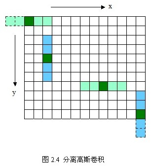
- 分离高斯模糊效果图：  
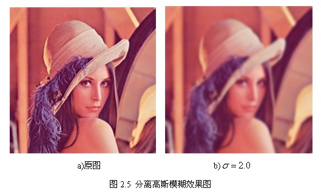
#### 第一组第一层图像的生成
- 很多初涉SIFT的都会被这个问题所困惑，这里要分两种情况：其一是把第一组的索引定为0；其二是把第一组的索引定为-1。
- 我们先考虑第一组索引为0的情况，我们知道第一组第一层的图像是由原图像与σ0（一般设置为1.6）的高斯滤波器卷积生成，那么原图像是谁呢？
- 是I(x,y)吗？不是！为了图像反走样的需要，通常假设输入图像是经过高斯平滑处理的，其值为σn=0.5，即半个像元。意思就是说我们采集到的图像I(x,y)，已经被σ=σn=0.5的高斯滤波器平滑过了。
- 所以我们不能直接对I(x,y)用σ0的高斯滤波器平滑，而应该用σ=√(σ0^2−σn^2)的高斯滤波器去平滑I(x,y)，即  
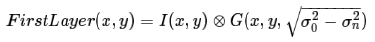
- 其中FirstLayer(x,y)表示整个尺度空间为第1组第1层的图像，σ0一般取1.6，σn=0.5。
- 现在我们来考虑把第一组的索引定为-1的情况。那么首先第一个问题便是为什么要把索引定为-1。如果索引为0，如上面那种情况所示，整个尺度空间的第1组的第1层图像已经是由原图像模糊生成的了，那么也就是说已经丢失了细节信息，那么原图像我们完全没有利用上。
- 基于这种考虑，我们先将图像放大2倍，这样原图像的细节就隐藏在了其中。
- 由上面一种情况分析，我们已经把I(x,y)看成是已经被σn=0.5模糊过的图像，那么将I(x,y)放大2倍后得到Is(x,y)，则可以看为是被2σn=1的高斯核模糊过的图像。
- 那么由Is生成第1组第1层的图像用的高斯滤波器的σ=√(σ0^2−(2σn)^2)。可以表示为。  
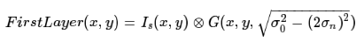
- 其中FirstLayer(x,y)表示整个尺度空间为第1组第1层的图像，Is(x,y)是由I(x,y)用双线性插值放大后的图像。σ0一般取1.6，σn=0.5。
#### 尺度空间生成了多少幅图像
- 我们知道S是我们最终构建出来的用来寻找特征点的高斯差分图像，而特征点的寻找需要查找的是空间局部极值，即在某一层上查找局部极值点的时候需要用到上一层与下一层的高斯差分图像，所以如果我们需要查找S层的特征点，需要S+2层高斯差分图像，然后查找其中的第2层到第S+1层。
- 这里假设S =3，则我们需要的高斯差分图像有S+2 = 5张，分别为G(x,y,σ),G(x,y,kσ),G(x,y,k^2σ),G(x,y,k^3σ),G(x,y,k^4σ)。
- 而每一个高斯差分图像G(x,y,σ)都需要两幅尺度空间的图像L(x,y,kσ)与L(x,y,σ)进行差分生成，那么我们则需要S+3 = 6张尺度空间图像来生成上面那些高斯差分图像，它们分别为：L(x,y,σ),L(x,y,kσ),L(x,y,k^2σ),L(x,y,k^3σ),L(x,y,k^4σ),L(x,y,k^5σ).
- 其中的G(x,y,kσ),G(x,y,k^2σ),G(x,y,k^3σ)这三张图像是我们用来查找局部极值点的图像。示意图如下：  

- 从上面的分析,我们知道对于尺度空间来说,我们一共需要S+3层图像来构建出来S+2层高斯差分图像。所以，如果整个尺度空间一共有O组，每组有S+3层图像。共O*(S+3)张尺度图像.
- 层(Storey)、组(Octave)之间的关系示意图如下：  

#### 为什么是倒数第3张
- 相信你在看很多SIFT算法描述里都这样写着，取上一张的倒数第3张图像隔行采样后作为下一组的第一张图像。
- 答案是为了保证尺度空间的连续性，我们下面来仔细分析。
- 我们知道对于尺度空间第o组，第s层的图像，它的尺度为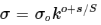，其中,k=2,o∈[0,1,2,…,nOctave−1],s∈[0,1,2,…,S+2]。
- 假设S =3,那么我们从第0组开始，看它各层的尺度。  
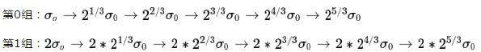
- 我们只分析2组便可以看出，第1组的第0层图像恰好与第0组的倒数第三幅图像一致，尺度都为2σ0，所以我们不需要再根据原图来重新卷积生成每组的第0张图像，只需采用上一层的倒数第3张来降采样即可。
- 我们也可以继续分析，第0组尺度空间得到的高斯差分图像的尺度为：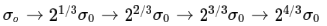
- 而第1组尺度空间得到的高斯差分图像的尺度为：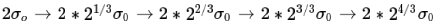
- 如果我们把它们的中间三项取出来拼在一起，则尺度为：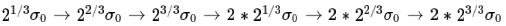,正好连续！！这一效果带来的直接的好处是在尺度空间的极值点确定过程中，我们不会漏掉任何一个尺度上的极值点，而是能够综合考虑量化的尺度因子。
### 特征点的搜索
#### 搜索策略
- 斑点的搜索是通过同一组内各DoG相邻层之间比较完成的。为了寻找尺度空间的极值点，每一个采样点要和它所有的相邻点进行比较，看其是否比它的图像域和尺度域的相邻点大或小。
- 对于其中的任意一个检测点都要和它同尺度的8个相邻点和上下相邻尺度对应的9×2个点共26个点比较，以确保在尺度空间和二维图像位置空间都检测到极值点。也就是，比较是在一个3×3的立方体内进行。
- 搜索过程从每组的第二层开始，以第二层为当前层，对第二层的DoG图像中的每个点取一个3×3的立方体，立方体上下层为第一层与第三层。这样，搜索得到的极值点既有位置坐标（DoG的图像坐标），又有空间尺度坐标（层坐标）。
- 当第二层搜索完成后，再以第三层作为当前层，其过程与第二层的搜索类似。当S=3时，每组里面要搜索3层。  

- ×表示采样点，o表示相邻点。
#### 关键点的精确定位(子像元插值)
- 以上的极值点的搜索是在离散空间中进行的，检测到的极值点并不是真正意义上的极值点。
- 下图显示了一维信号离散空间得到的极值点与连续空间的极值点之间的差别。利用已知的离散空间点插值到连续空间极值点的方法叫子像元插值。  
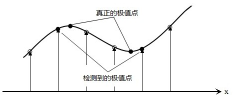
- 首先我们来看一个一维函数插值的例子。我们已经f(x)上几个点的函数值f(−1)=1,f(0)=6,f(1)=5，求f(x)在[−1,1]上的最大值。
- 如果我们只考虑离散的情况，那么只用简单比较一下，便知最大值为f(0)=6，下面我们用子像元插值法来考虑连续区间的上情况。
- 利用泰勒级数，可以将f(x)在f(0)附近展开为：  
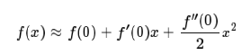
- 另外我们知道f(x)在x处的导数写成离散的形式为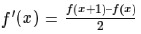，二阶导数写成离散形式为f″(x)=f(x+1)+f(x−1)−2f(x)。
- 所以，我们可以算出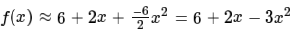
- 求取函数f(x)的极大值和极大值所在的位置：  
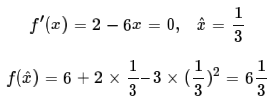
- 现在回到我们SIFT点检测中来，我们要考虑的是一个三维问题，假设我们在尺度为σ的尺度图像D(x,y)上检测到了一个局部极值点，空间位置为(x,y,σ)，由上面的分析我们知道，它只是一个离散情况下的极值点，连续情况下，极值点可能落在了(x,y,σ)的附近，设其偏离了(x,y,σ)的坐标为(Δx,Δy,Δσ)。
- 则对D(Δx,Δy,Δσ)可以表示为在点(x,y,σ)处的泰勒展开：  
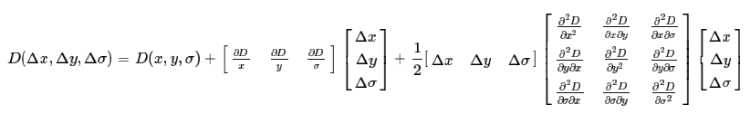
- 可以将上式写成矢量形式如下：  
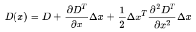
- 令上式的一阶导数等于0，可以求得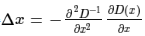
- 通过多次迭代(Lowe算法里最多迭代5次)，得到最终候选点的精确位置与尺度x^，将其代入公式求得D(x^)，求其绝对值得|D(x^)|。如果其绝对值低于阈值的将被删除。
#### 删除边缘效应
- 为了得到稳定的特征点，只是删除DoG响应值低的点是不够的。由于DoG对图像中的边缘有比较强的响应值，而一旦特征点落在图像的边缘上，这些点就是不稳定的点。
- 一方面图像边缘上的点是很难定位的，具有定位歧义性；另一方面这样的点很容易受到噪声的干扰而变得不稳定。
- 一个平坦的DoG响应峰值往往在横跨边缘的地方有较大的主曲率，而在垂直边缘的方向有较小的主曲率。而主曲率可以通过2×2的Hessian矩阵H求出：  
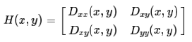
- 上式中，D值可以通过求取邻近点像素的差分得到。H的特征值与D的主曲率成正比例。我们可以避免求取具体的特征值，因为我们只关心特征值的比例。
- 令α=λmax为最大的特征值，β=λmin为最小的特征值，那么，我们通过H矩阵直迹计算它们的和，通过H矩阵的行列式计算它们的乘积： 
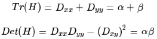 
- 如果γ为最大特征值与最小特征值之间的比例，那么α=γβ，这样便有  
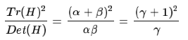
- 上式的结果只与两个特征值的比例有关，而与具体特征值无关。
- 当两个特征值相等时，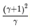的值最小，随着γ的增加，的值也增加。所以要想检查主曲率的比例小于某一阈值γ，只要检查下式是否成立：  
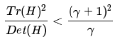
- Lowe在论文中给出的γ=10。也就是说对于主曲率比值大于10的特征点将被删除。
### 方向确定
- 为了使描述符具有旋转不变性，需要利用图像的局部特征为给每一个关键点分配一个基准方向。使用图像梯度的方法求取局部结构的稳定方向。
- 对于在DoG金字塔中检测出的关键点，采集其所在高斯金字塔图像3σ邻域窗口内像素的梯度和方向分布特征。梯度的模值和方向如下：  
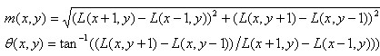
- L为每个关键点所在的尺度空间值。至此，图像的关键点已经检测完毕，每个关键点的三个信息：位置、所处尺度、方向，由此可以确定一个SIFT特征区域。
- 梯度直方图的范围是0～360度，其中每10度一个柱，总共36个柱。随着距
中心点越远的领域其对直方图的贡献也响应减小.Lowe论文中还提到要使用高斯函数对直方图进行平滑，减少突变的影响。
- 在实际计算时，我们在以关键点为中心的邻域窗口内采样，并用直方图统计邻域像素的梯度方向。梯度直方图的范围是0～360度，其中每45度一个柱，总共8个柱, 或者每10度一个柱，总共36个柱。
- Lowe论文中还提到要使用高斯函数对直方图进行平滑，减少突变的影响。
- 直方图的峰值则代表了该关键点处邻域梯度的主方向，即作为该关键点的方向。  

- 直方图中的峰值就是主方向，其他的达到最大值80%的方向可作为辅助方向。  

### 关键点描述
- 首先将坐标轴旋转为关键点的方向，以确保旋转不变性。  

- 以关键点为中心取8×8的窗口。  

- 图左部分的中央为当前关键点的位置，每个小格代表关键点邻域所在尺度空间的一个像素，利用公式求得每个像素的梯度幅值与梯度方向，箭头方向代表该像素的梯度方向，箭头长度代表梯度模值，然后用高斯窗口对其进行加权运算。图右部分为其加权到8个主方向后的效果。
- 图中蓝色的圈代表高斯加权的范围（越靠近关键点的像素梯度方向信息贡献越大）。然后在每4×4的小块上计算8个方向的梯度方向直方图，绘制每个梯度方向的累加值，即可形成一个种子点，如图右部分示。
- 此图中一个关键点由2×2共4个种子点组成，每个种子点有8个方向向量信息。这种邻域方向性信息联合的思想增强了算法抗噪声的能力，同时对于含有定位误差的特征匹配也提供了较好的容错性。
- 计算keypoint周围的16*16的window中每一个像素的梯度，而且使用高斯下降函数降低远离中心的权重。  

- 在每个4*4的1/16象限中，通过加权梯度值加到直方图8个方向区间中的一个，计算出一个梯度方向直方图。
- 这样就可以对每个feature形成一个4*4*8=128维的描述子，每一维都可以表示4*4个格子中一个的scale/orientation. 将这个向量归一化之后，就进一步去除了光照的影响。
### 根据SIFT进行Match
- 生成了A、B两幅图的描述子，（分别是k1*128维和k2*128维），就将两图中各个scale（所有scale）的描述子进行匹配，匹配上128维即可表示两个特征点match上了。
- 实际计算过程中，为了增强匹配的稳健性，Lowe建议对每个关键点使用4×4共16个种子点来描述，这样对于一个关键点就可以产生128个数据，即最终形成128维的SIFT特征向量。
- 此时SIFT特征向量已经去除了尺度变化、旋转等几何变形因素的影响，再继续将特征向量的长度归一化，则可以进一步去除光照变化的影响。
- 当两幅图像的SIFT特征向量生成后，下一步我们采用关键点特征向量的欧式距离来作为两幅图像中关键点的相似性判定度量。
- 取图像1中的某个关键点，并找出其与图像2中欧式距离最近的前两个关键点，在这两个关键点中，如果最近的距离除以次近的距离少于某个比例阈值，则接受这一对匹配点。降低这个比例阈值，SIFT匹配点数目会减少，但更加稳定。
- 为了排除因为图像遮挡和背景混乱而产生的无匹配关系的关键点,Lowe提出了比较最近邻距离与次近邻距离的方法,距离比率ratio小于某个阈值的认为是正确匹配。
- 因为对于错误匹配,由于特征空间的高维性,相似的距离可能有大量其他的错误匹配,从而它的ratio值比较高。
- Lowe推荐ratio的阈值为0.8。但作者对大量任意存在尺度、旋转和亮度变化的两幅图片进行匹配，结果表明ratio取值在0. 4~0. 6之间最佳，小于0. 4的很少有匹配点，大于0. 6的则存在大量错误匹配点。(如果这个地方你要改进，最好给出一个匹配率和ration之间的关系图，这样才有说服力)。
- 作者建议ratio的取值原则如下:
- ratio=0. 4　对于准确度要求高的匹配；
- ratio=0. 6　对于匹配点数目要求比较多的匹配； 
- ratio=0. 5　一般情况下。
- 也可按如下原则:当最近邻距离<200时ratio=0. 6，反之ratio=0. 4。ratio的取值策略能排分错误匹配点。
- 实验结果：  
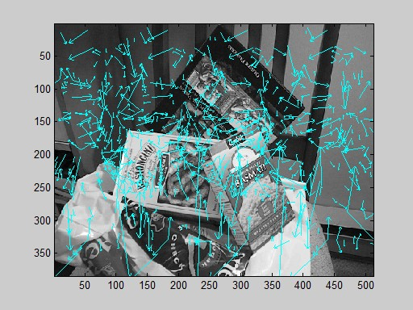  
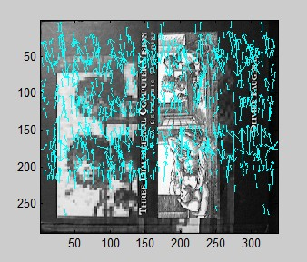  
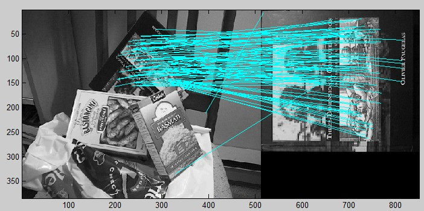