## 加速鲁棒特征(SURF)
- 如果说SIFT算法中使用DOG对LOG进行了简化，提高了搜索特征点的速度，那么SURF算法则是对DoH的简化与近似。
- 虽然SIFT算法已经被认为是最有效的，也是最常用的特征点提取的算法，但如果不借助于硬件的加速和专用图像处理器的配合，SIFT算法以现有的计算机仍然很难达到实时的程度。
- 对于需要实时运算的场合，如基于特征点匹配的实时目标跟踪系统，每秒要处理8-24帧的图像，需要在毫秒级内完成特征点的搜索、特征矢量生成、特征矢量匹配、目标锁定等工作，这样SIFT算法就很难适应这种需求了。
- SURF借鉴了SIFT中简化近似的思想，把DoH中的高斯二阶微分模板进行了简化，使得模板对图像的滤波只需要进行几个简单的加减法运算，并且，这种运算与滤波器的尺度无关。
- 实验证明，SURF算法较SIFT在运算速度上要快3倍左右。
### 积分图像
- SURF算法中要用到积分图像的概念。借助积分图像，图像与高斯二阶微分模板的滤波转化为对积分图像的加减运算。
- 积分图像中任意一点(i,j)的值ii(i,j)，为原图像左上角到点(i,j)相应的对角线区域灰度值的总和，即  
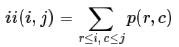
- 式中，p(r,c)表示图像中点(r,c)的灰度值，ii(i,j)可以用下面两式迭代计算得到  
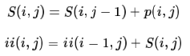
- 式中，S(i,j)表示一列的积分，且S(i,−1)=0,ii(−1,j)=0。求积分图像，只需要对原图像所有像素进行一遍扫描。
- 这样说比较抽象，还不如下图好理解：  

- 一旦积分图计算好了，计算图像内任何矩形区域的像素值的和只需要三个加法，如上图所示。
### DoH近似
- 我们可以利用Hessian矩阵行列式的极大值检测斑点。下面我们给出Hessian矩阵的定义。
- 给定图像I中的一个点x(i,j)，在点x处，尺度为σ的Hessian矩阵H(x,σ)定义如下：  
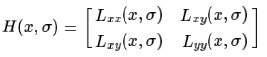
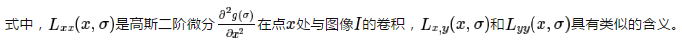
- 下面显示的是上面三种高斯微分算子的图形。  

- 但是利用Hessian行列式进行图像斑点检测时，有一个缺点。由于二阶高斯微分被离散化和裁剪的原因，导致了图像在旋转奇数倍的π/4时，即转换到模板的对角线方向时，特征点检测的重复性降低（也就是说，原来特征点的地方，可能检测不到特征点了）。
- 而在π/2时，特征点检测的重现率真最高。但这一小小的不足不影响我们使用Hessian矩阵进行特征点的检测。
- 为了将模板与图产像的卷积转换为盒子滤波运算，我们需要对高斯二阶微分模板进行简化，使得简化后的模板只是由几个矩形区域组成，矩形区域内填充同一值，如下图所示，在简化模板中白色区域的值为正数，黑色区域的值为负数，灰度区域的值为0。  

- 盒子滤波器是一种近似。首先左边是高斯滤波器。由于surf算子是寻找特征点，它所定义的特征点就是明暗变化最大的点，采用Hessian矩阵行列式的极大值来判断。
- 但是由于多尺度原因，所以需要高斯滤波器构建多尺度，这也是为什么出现高斯滤波器原因。右边是它简化的模型，变成盒子滤波器。
- 盒子滤波器的特点就是，滤波器能分为几个矩形区域，当用盒子滤波器卷积时，由于是矩形区域与像素区域对应相乘求和，就转换为像素求和然后乘以矩形区域中的系数。
#### 所以用盒子滤波器做卷积，就变成了像素求和，像素求和就是积分图像。这也就是加速的原因。
- 在盒子滤波器换行时,相邻行之间象素的邻域也有大量的重叠区域,如何记录从一行换到下一行的交集信息呢?
- 分析可知,实际上改变了邻域中按列的累加和，因此,还需要一个数据结构记录邻域中每列的累加和，水平滑动时去左添右，垂直换行时去上添下。
- 示意图如下：  
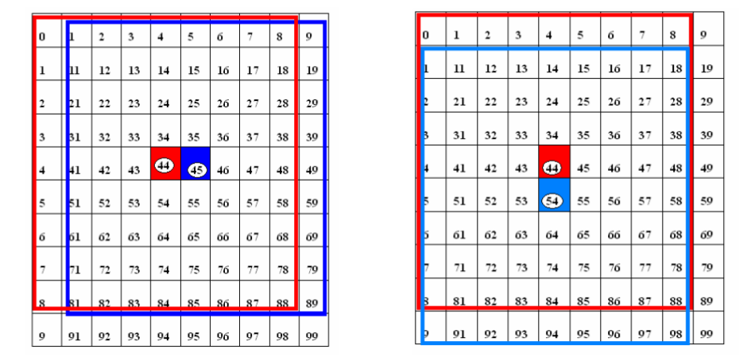
- 对于σ=1.2的高斯二阶微分滤波器，我们设定模板的尺寸为9×9的大小，并用它作为最小尺度空间值对图像进行滤波和斑点检测。我们使用Dxx、Dxy和Dyy表示模板与图像进行卷积的结果。这样，便可以将Hessian矩阵的行列式作如下的简化。  
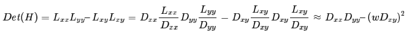
- 滤波器响应的相关权重w是为了平衡Hessian行列式的表示式。这是为了保持高斯核与近似高斯核的一致性。  
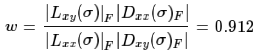
- 其中|X|F为Frobenius范数。理论上来说对于不同的σ的值和对应尺寸的模板尺寸，w值是不同的，但为了简化起见，可以认为它是同一个常数。
- 使用近似的Hessian矩阵行列式来表示图像中某一点x处的斑点响应值，遍历图像中所有的像元点，便形成了在某一尺度下琉璃点检测的响应图像。
- 使用不同的模板尺寸，便形成了多尺度斑点响应的金字塔图像，利用这一金字塔图像，就可以进行斑点响应极值点的搜索，其过程完全与SIFT算法类同。
### 尺度空间表示
- 通常想要获取不同尺度的斑点，必须建立图像的尺度空间金字塔。一般的方法是通过不同σ的高斯函数，对图像进行平滑滤波，然后重采样图像以获得更高一层的金字塔图像。
- SIFT特征检测算法中就是通过相邻两层图像金字塔相减得到DoG图像，然后再在DoG图像上进行斑点和边缘检测工作的。
- 由于采用了盒子滤波和积分图像，所以，我们并不需要像SIFT算法那样去直接建立图像金字塔，而是采用不断增大盒子滤波模板的尺寸的间接方法。
- 通过不同尺寸盒子滤波模板与积分图像求取Hessian矩阵行列式的响应图像。然后在响应图像上采用3D非最大值抑制，求取各种不同尺度的斑点。
- 如前所述，我们使用9×9的模板对图像进行滤波，其结果作为最初始的尺度空间层（此时，尺度值为s=1.2，近似σ=1.2的高斯微分），后续的层将通过逐步放大滤波模板尺寸，以及放大后的模板不断与图像进行滤波得到。
- 由于采用盒子滤波和积分图像，滤波过程并不随着滤波模板尺寸的增加而使运算工作量增加。
- 与SIFT算法类似，我们需要将尺度空间划分为若干组（Octaves）。一个组代表了逐步放大的滤波模板对同一输入图像进行滤波的一系列响应图。
- 每个组又由若干固定的层组成。由于积分图像离散化的原因，两个层之间的最小尺度变化量是由高斯二阶微分滤波器在微分方向上对正负斑点响应长度l0决定的，它是盒子滤波器模板尺寸的1/3。
- 对于9×9的模板，它的l0=3。一下层的响应长度至少应该在l0的基础上增加2个像素，以保证一边一个像素，即l0=5。这样模板的尺寸就为15×15。
- 以此类推，我们可以得到一个尺寸增大模板序列，它们的尺寸分别为：9×9，15×15，21×21，27×27，黑色、白色区域的长度增加偶数个像素，以保证一个中心像素的存在。  

- 采用类似的方法来处理其他几组的模板序列。其方法是将滤波器尺寸增加量翻倍（6，12，24，38）。这样，可以得到第二组的滤波器尺寸，它们分别为15，27，39，51。第三组的滤波器尺寸为27，51，75，99。
- 如果原始图像的尺寸仍然大于对应的滤波器尺寸，尺度空间的分析还可以进行第四组，其对应的模板尺寸分别为51，99，147和195。
- 下图显示了第一组至第三组的滤波器尺寸变化。  

- 组(octaves)内层(scale)间尺寸，9,15,21,27之间相差6,15,27,39,51之间相差12.
- 在通常尺度分析情况下，随着尺度的增大，被检测到的斑点数量迅速衰减。所以一般进行3-4组就可以了，与此同时，为了减少运算量，提高计算的速度，可以考虑在滤波时，将采样间隔设为2。
- 对于尺寸为L的模板，当用它与积分图运算来近似二维高斯核的滤波时，对应的二维高斯核的参数σ=1.2×L/9，这一点至关重要，尤其是在后面计算描述子时，用于计算邻域的半径时。
### 特征点检索
- 为了在图像及不同尺寸中定位兴趣点，我们用了3×3×3邻域非最大值抑制。具体的步骤基本与SIFT一致，而且Hessian矩阵行列式的最大值在尺度和图像空间被插值。
### 特征点方向分配
- 为了保证特征矢量具有旋转不变性，与SIFT特征一样，需要对每个特征点分配一个主方向。
- 为此，我们需要以特征点为中心，以6s（s=1.2*L/9为特征点的尺度）为半径的圆形区域，对图像进行Haar小波响应运算。
- 这样做实际就是对图像进行梯度运算只不过是我们需要利用积分图像，提高计算图像梯度的效率。在SIFT特征描述子中我们在求取特征点主方向时，是以特征点为中心，在以4.5σ为半径的邻域内计算梯度方向直方图。
- 事实上，两种方法在求取特征点主方向时，考虑到Haar小波的模板带宽，实际计算梯度的图像区域是相同的。用于计算梯度的Harr小波的尺度为4s。
- 我们在以某个兴趣点为圆心,以6S(S为该兴趣点对应的尺度)为半径的圆形邻域里,用尺寸为4S的Haar小波模板对图像进行处理,求x、y两个方向的Haar小波响应。
- Haar小波的模板如下图所示,其中左侧模板计算x方向的响应,右侧模板计算y方向的响应,黑色表示一1,白色表示+1。  
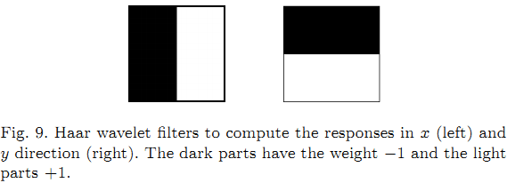
- 用Haar小波滤波器对圆形邻域进行处理后,就得到了该邻域内每个点所对应的x、y方向的响应,然后用以兴趣点为中心的高斯函数(σ=2s)对这些响应进行加权。
- 为了求取主方向值，以特征点为中心，用一个圆心角为PI/3扇形以兴趣点为中心环绕一周,计算该扇形处于每个角度时,它所包括的图像点的Haar小波响应之和。
- 由于每一点都有x、y两个方向的响应,对滑动窗口内的图像Harr小波响应值dx、dy进行累加，扇形区域中所有点的响应之和构成一个矢量(mw,θw):  
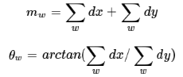
- 把扇形区域环绕一周所形成的矢量都记录下来,取长度最大的矢量,其方向即为该兴趣点所对应的方向,即主方向为最大Harr响应累加值所对应的方向，也就是最长矢量所对应的方向：  
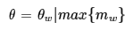
- 可以依照SIFT求方方向时策略，当存在另一个相当于主峰值80%能量的峰值时，则将这个方向认为是该特征点的辅方向。
- 一个特征点可能会被指定具有多个方向（一个主方向，一个以上辅方向），这可以增强匹配的鲁棒性。
- 和SIFT的描述子类似，如果在mw中出现另一个大于主峰能量max{mw}80时的次峰，可以将该特征点复制成两个特征点。
- 一个主的方向为最大响应能量所对应的方向，另一个主方向为次大响应能量所对应的方向。  

### 特征点特征矢量生成
- 生成特征点描述子与确定特征点方向有些类似，它需要计算图像的Haar小波响应。不过，与主方向的确定不同的是，这次我们不是使用一个圆形区域，而是在一个矩形区域来计算Haar小波响应。
- 以特征点为中心，确定一个边长为20s的正方形邻域，以特征点方向作为该邻域的y轴方向。
- 沿主方向将20s×20s的图像划分为4×4个子块，每个子块利用尺寸2s的Harr模板进行响应值进行响应值计算，然后对响应值进行统计∑dx、∑|dx|、∑dy、∑|dy|形成特征矢量。
- 如下图所示。图中，以特征点为中心，以20s为边长的矩形窗口为特征描述子计算使用的窗口，特征点到矩形边框的线段表示特征点的主方向。  
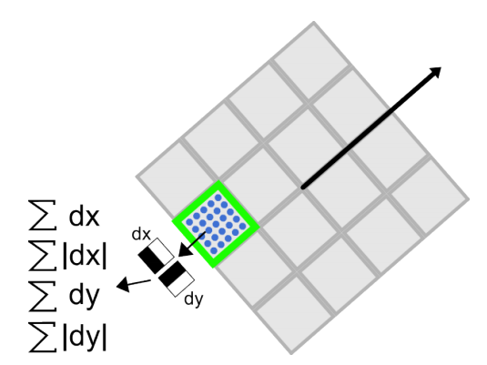
- 将20s的窗口划分成4×4子窗口，每个子窗口有5s×5s个像素。使用尺寸为2s的Harr小波对子窗口图像进行其响应值计算，共进行25次采样，分别得到沿主方向的dy和垂直于主方向的dx。
- 然后，以特征点为中心，对dy和dx进行高斯加权计算，高斯核的参数为即σ=3.3s(即20s/6)。最后，分别对每个子块的响应值进行统计，得到每个子块的矢量：  
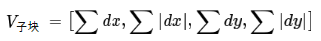
- 由于共有4×4个子块，因此，特征描述子共由4×4×4=64维特征矢量组成。
- SURF描述子不仅具有尺度和旋转不变性，而且对光照的变化也具有不变性。使小波响应本身就具有亮度不变性，而对比度的不变性则是通过将特征矢量进行归一化来实现。
- 下图给出了三种不同图像模式的子块得到的不同结果。对于实际图像的描述子，我们可以认为它们是由这三种不同模式图像的描述子组合而成的。  

- 为了充分利用积分图像进行Haar小波的响应计算，我们并不直接旋转Haar小波模板求得其响应值，而是在积图像上先使用水平和垂直的Haar模板求得响应值dy和dx，然后根据主方向旋转dx和dy与主方向保持一致，如下图所示。  
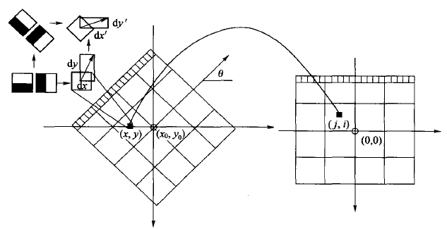
- 为了求得旋转后Haar小波响应值，首先要得到旋转前图像的位置。旋转前后图像的位置关系，可以通过点的旋转公式得到：  
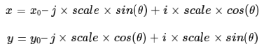
- 在得到点(j,i)在旋转前对应积分图像的位置(x,y)后，利用积分图像与水平、垂直Harr小波，求得水平与垂直两个方向的响应值dx和dy。对dx和dy进行高斯加权处理，并根据主方向的角度，对dx和dy进行旋转变换，从而，得到旋转后的dx’和dy’。其计算公式如下：  
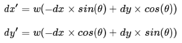
### 特征描述子
- 一般而言，特征矢量的长度越长，特征矢量所承载的信息量就越大，特征描述子的独特性就越好，但匹配时所付出的时间代价就越大。
- 对于SURF描述子，可以将它扩展到用128维矢量来表示。具体方法是在求∑dx、∑|dx|时区分dy<0和dy≥0情况。同时，在求取∑dy、∑|dy|时区分dx<0和dx≥0情况。
- 这样，每个子块就产生了8个梯度统计值，从而使描述子特征矢量的长度增加到8×4×4=128维。
- 为了实现快速匹配，SURF在特征矢量中增加了一个新的变量，即特征点的拉普拉斯响应正负号。
- 在特征点检测时，将Hessian矩阵的迹的正负号记录下来，作为特征矢量中的一个变量。
- 这样做并不增加运算量，因为特征点检测进已经对Hessian矩阵的迹进行了计算。
- 在特征匹配时，这个变量可以有效地节省搜索的时间，因为只有两个具有相同正负号的特征点才有可能匹配，对于正负号不同的特征点就不进行相似性计算。
- 简单地说，我们可以根据特征点的响应值符号，将特征点分成两组，一组是具有拉普拉斯正响应的特征点，一组是具有拉普拉斯负响应的特征点，匹配时，只有符号相同组中的特征点才能进行相互匹配。显然，这样可以节省特征点匹配的时间。如下图所示。  
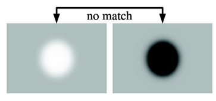
- 总体来说，如果理解了SIFT算法，再来看SURF算法会发现思路非常简单。尤其是局部最大值查找方面，基本一致。关键还是一个用积分图来简化卷积的思路，以及怎么用不同的模板来近似原来尺度空间中的高斯滤波器。
- 实际上有文献指出，SURF比SIFT工作更出色。他们认为主要是因为SURF在求取描述子特征矢量时，是对一个子块的梯度信息进行求和，而SIFT则是依靠单个像素梯度的方向。