## Scale space (尺度空间)
#### 特征的不变性
- 每个物体，我们总可以用一些词语或部件来描述它，比如人脸的特征：两个眼睛、一个鼻子和一个嘴巴。
- 对于图像而言，我们需要计算机去理解图像，描述图像就需要计算机去取得图像的特征，对图像比较全面的描述即一个二维矩阵，矩阵内的每个值代表图像的亮度。
- 有时候我们需要让计算机更简化的来描述一个图像，抓住一些显著特征，这些特征要具有一些良好的性质，比如局部不变性。
- 局部不变性一般包括两个方面：
- 尺度不变性：人类在识别一个物体时，不管这个物体或远或近，都能对它进行正确的辨认，这就是所谓的尺度不变性。尺度空间理论经常与生物视觉关联，有人也称图像局部不变性特征为基于生物视觉的不变性方法。
- 旋转不变性：当这个物体发生旋转时，我们照样可以正确地辨认它，这就是所谓的旋转不变性。
#### 局部不变特征
- 全局特征：从整个图像中抽取的特征。较多的运用在图像检索领域，如图像颜色直方图。。
- 局部特征：从图像的局部区域中抽取的特征(这个局部区域往往是图像中的一个像素及它周围的邻域)。
- 一种好的局部特征应该具有下面的特性：
1. 可重复性：同一个物体在不同时间，不同角度拍到图像中，检测到的特征对应的越多越好。
2. 独特性：特征在该物体上表现为独特性，能与场景下其他物体区分。
3. 局部性：特征往往是物体某个局部的特点，这样才可以避免遮挡时不能匹配的问题。
4. 数量性：检测到的特征数目一定要多，密集度最好能在一定程度上反映图像的内容。
5. 准确性：得到的特征应该能被精确定位，能够精确到像素。
6. 高效性：特征检测算法运算要快。
#### 图像尺度空间理论
- 当用一个机器视觉系统分析未知场景时，计算机没有办法预先知识图像中物体尺度，因此，我们需要同时考虑图像在多尺度下的描述，获知感兴趣物体的最佳尺度。
- 所以在很多时候，我们会在将图像构建为一系列不同尺度的图像集，在不同的尺度中去检测我们感兴趣的特征。比如：在Harr特征检测人脸的时候，因为我们并不知道图像中人脸的尺寸，所以需要生成一个不同大小的图像组成的金字塔，扫描其中每一幅图像来寻找可能的人脸。
#### 图像的高斯金字塔
- 图像金字塔化的一般步骤：
- 首先，图像经过一个低通滤波器进行平滑（这个步骤会使图像变模糊，好像模仿人的视觉中远处的物体没有近处的清晰的原理）。
- 然后，对这个平滑后的图像进行抽样（一般抽样比例在水平和竖直方向上都为1/2），从而得到一系列的缩小的图像。  
- 高斯金字塔是最基本的图像塔。首先将原图像作为最底层图像G0（高斯金字塔的第0层），利用高斯核（5*5）对其进行卷积，然后对卷积后的图像进行下采样（去除偶数行和列）得到上一层图像G1，将此图像作为输入，重复卷积和下采样操作得到更上一层图像，反复迭代多次，形成一个金字塔形的图像数据结构，即高斯金字塔。  
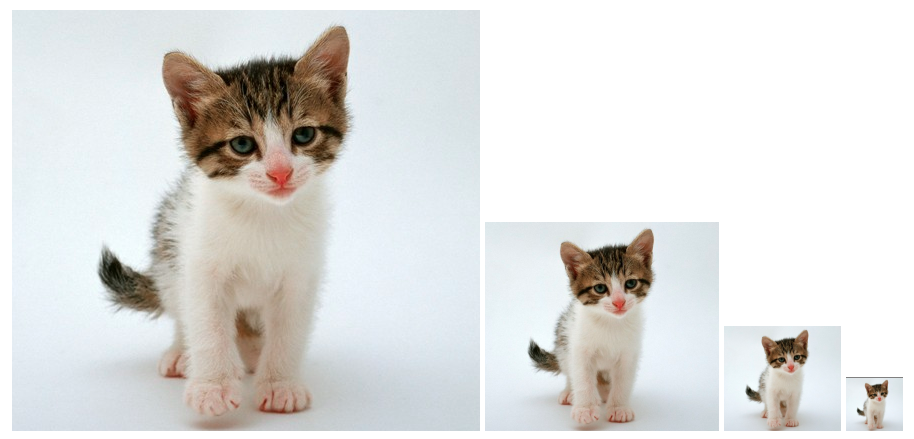
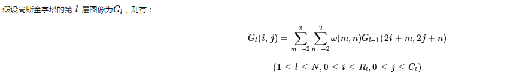
- 公式中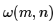是滤波器(核)，进行了隔行降采样。
- 式中，N为高斯金字塔顶层号；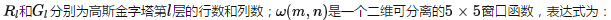
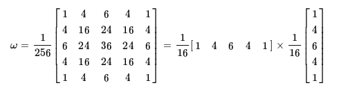
- 写成上面的形式是为了说明，二维窗口的卷积算子，可以写成两个方向上的1维卷积核（二项核）的乘积。上面卷积形式的公式实际上完成了2个步骤：1）高斯模糊；2）降维。  
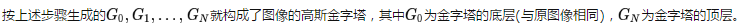可见高斯金字塔的当前层图像是对其前一层图像先进行高斯低通滤波，然后做隔行和隔列的降采样(去除偶数行与偶数列)而生成的。当前层图像的大小依次为前一层图像大小的1/4。
- 由此可见高斯金字塔的当前层图像就是对其前一层图像首先进行高斯低通滤波，然后再进行隔行和隔列的降2采样而生成的。前一层图像大小依次为当前层图像大小的4倍。
#### 图像的拉普拉斯金字塔
- 在高斯金字塔的运算过程中，图像经过卷积和下采样操作会丢失部分高频细节信息。为描述这些高频信息，人们定义了拉普拉斯金字塔(Laplacian Pyramid，LP)。
- 用高斯金字塔的每一层图像减去其上一层图像上采样并高斯卷积之后的预测图像，得到一系列的差值图像即为 LP 分解图像。  
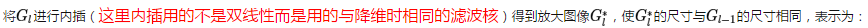
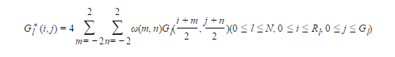
- 上面的系数4，是因为每次能参与加权的项，的权值和为4/256，这个与我们用的ω的值有关。  
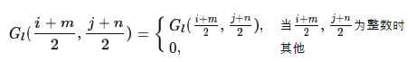
- 在偶数行和列插入0，然后使用下采样中的高斯核进行滤波处理，得到和l-1层一样大小的图像。  
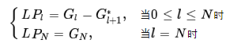  
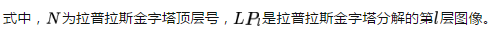  
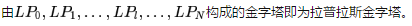它的每一层图像是高斯金字塔本层图像与其高一级的图像经内插放大后图像的差，此过程相当于带通滤波，因此拉普拉斯金字塔又称为带通金字塔分解。
- 下图为小猫图像的拉普拉斯金字塔图像：  
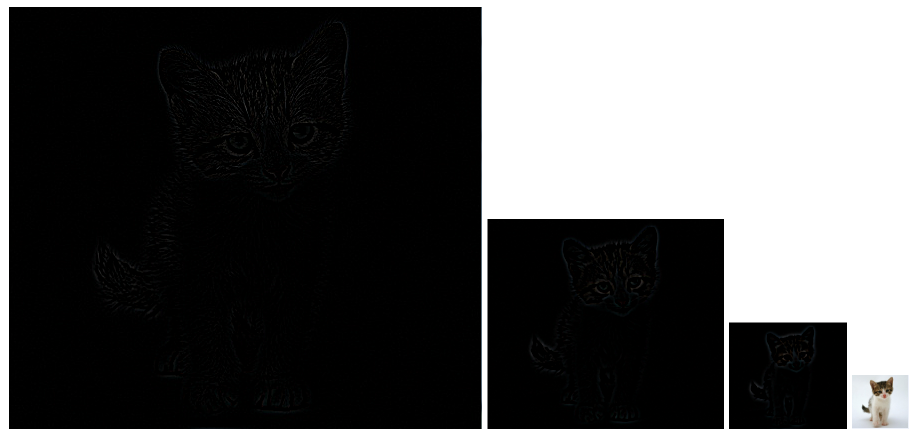
#### 高斯核
- 图像的金字塔化能高效地（计算效率也较高）对图像进行多尺度的表达，但它缺乏坚实的理论基础，不能分析图像中物体的各种尺度（虽然我们有小猫的金字塔图像，我们还是不知道原图像内小猫的大小）。
- 信号的尺度空间刚提出是就是通过一系列单参数、宽度递增的高斯滤波器将原始信号滤波得到到组低频信号。那么一个很明显的疑问是：除了高斯滤波之外，其他带有参数t的低通滤波器是否也可以用来生成一个尺度空间。
- 后来Koenerink、Lindeberg[Scale-space theory in computer vision]、Florack等人用精确的数学形式通过不同的途径都证明了高斯核是实现尺度变换的唯一变换核。
- 虽然很多研究者从可分性、旋转不变性、因果性等特性推出高斯滤波器是建立线性尺度空间的最优滤波器。然后在数字图像处理中，需要对核函数进行采样，离散的高斯函数并不满足连续高斯函数的的一些优良的性质。所以后来出现了一些非线性的滤波器组来建立尺度空间，如B样条核函数。
- 使用高斯滤波器对图像进行尺度空间金塔塔图的构建，让这个尺度空间具有下面的性质：
1. 加权平均和有限孔径效应
- 信号在尺度t上的表达可以看成是原信号在空间上的一系列加权平均，权重就是具有不同尺度参数的高斯核。
- 信号在尺度t上的表达也对应于用一个无方向性的孔径函数（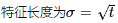）来观测信号的结果。这时候信号中特征长度小于σ的精细结构会被抑制[理解为一维信号上小于σ的波动会被平滑掉]。
2. 层叠平滑
也叫高斯核族的半群（Semi-Group）性质：两个高斯核的卷积等同于另外一个不同核参数的高斯核卷积。  
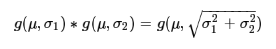
- 这个性质的意思就是说不同的高斯核对图像的平滑是连续的。
3. 局部极值递性
- 这个特征可以从人眼的视觉原理去理解，人在看一件物体时，离得越远，物体的细节看到的越少，细节特征是在减少的。高斯核对图像进行滤波具有压制局部细节的性质。
4. 尺度伸缩不变性
- 这里只是一个公式推导的问题，对原来的信号加一个变换函数，对变换后的信号再进行高斯核的尺度空间生成，新的信号的极值点等特征是不变的。
#### 尺度选择
- 一般我们采集到的图像中，我们并不知道我们感兴趣的目标在图像中的尺度，在这样的情况下，我们对图像进行分析时就无法选择合适的参数，比如边缘检测，可能由于参数不当，而造成过多的局部细节。
- 如下图所示：红色圆圈内的斑点的大小（直径）比例对应着两幅图像之间尺度比例（scale ratio）。如果对两幅图像采用相同的固定尺度的LoG检测器检测，很难将这两个斑点检测出来。
- LoG检测器相当于一个匹配滤波器，只有当LoG的尺度与图片中斑点结构尺度相当时才会有较强的响应。
- 如果用与左图中斑点结构相当大小尺度LoG算子，在中的大斑点的对应的LoG响应很小不能被检测出来，反之亦然。因此固定尺度的LoG斑点检测器不具有尺度不变性。
- 使用尺度空间进行多尺度检测可以将两幅图像中不同尺度的斑点检测出来。但是由于斑点结构是在一定尺度范围之内存在的，比如用5~8尺度的LoG可能都能检测出来右边图像中的斑点结构，所以在尺度空间中进行斑点检测会有重复检测的缺点。    
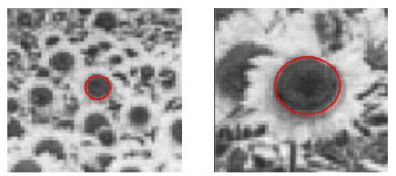
- 在实际操作中，我们需要定义一个特征响应函数，在不同的尺度空间上寻找一个极值点。
- 比如小猫的金字塔图像分析时，我们定义了一个大小为[w,h]的小猫的模板，用这个模板去与金字塔系列图像匹配，一定有匹配度最佳（即特征响应最强）。
- 需要注意的是，图像结构往往是在粗糙的尺度上被检测到，此时位置信息未必是最准确的，因此通常图像的尺度分析包含两个阶段：首先在粗尺度上进行特征（结构）检测，然后再在细尺度上进行精确定位。