## 空域(spatial domain)滤波  
- 空间域：（spatial domain）也叫空域，即所说的像素域，在空域的处理就是在像素级的处理，如在像素级的图像叠加。
#### 空域滤波(空域卷积、卷积)
- 将模板在图像中逐像素移动，将卷积核的每个元素分别和图像矩阵对应位置元素相乘并将结果累加，累加和作为模板中心对应像素点的卷积结果。
- 通俗的讲，卷积就是对整幅图像进行加权平均的过程，每一个像素点的值，都由其本身和邻域内的其他像素值经过加权平均后得到。
- 在像素的处理上，是先将结果暂存在于一个副本，最后统一拷贝，故不会出现处理顺序不同而结果不同的情况。
- 卷积运算，其实就是可看作是加权求和的过程，使用到的图像区域中的每个像素分别与卷积核(权矩阵)的每个元素对应相乘，所有乘积之和作为区域中心像素的新值。
- 卷积运算原理：  
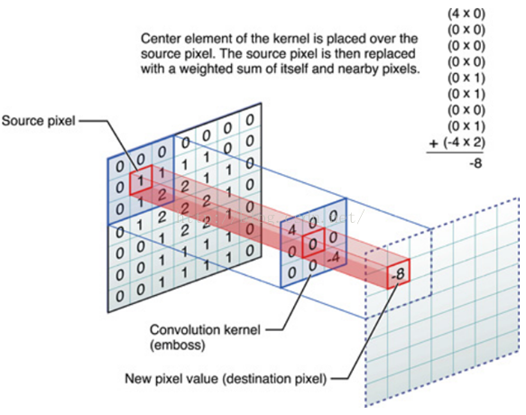
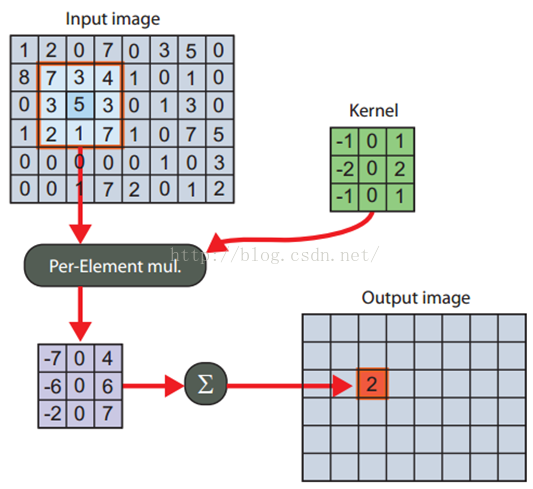
- 卷积运算过程及结果：  

#### 边界处理
- 那卷积核遇到图像边缘怎么办？例如图像顶部的像素，它的上面已经没有像素了，那么它的值如何计算？
- 目前有四种主流的处理方法，我们用一维卷积和均值滤波来说明下。
- 我们在1D图像中，用每个像素和它的二邻域的平均值来取代它的值。假设我们有个1D的图像I是这样的：  
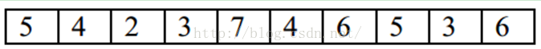  
-  对非图像边界的像素的操作比较简单。假设我们对I的第四个像素3做局部平均。也就是我们用2,3和7做平均，来取代这个位置的像素值。
- 也就是，平均会产生一副新的图像J，这个图像在相同位置J(4)=(I(3)+I(4)+I(5))/3=(2+3+7)/3=4。同样，我们可以得到J(3)=(I(2)+I(3)+I(4))/3=(4+2+3)/3=3。
- 需要注意的是，新图像的每个像素都取决于旧的图像，在计算J (4)的时候用J (3)是不对的，而是用I(3)，I(4)和I(5)。
- 所以每个像素都是它和它邻域两个像素的平均。平均是线性的操作，因为每个新的像素都是旧像素的线性组合。  
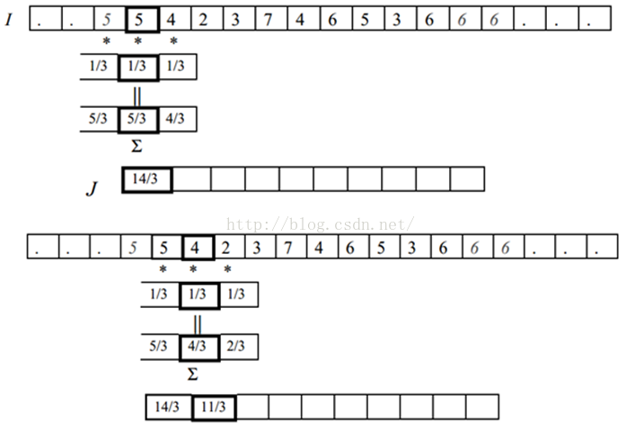
- 对卷积，也有必须要考虑的情况是，在图像边界的时候，怎么办？J(1)的值应该是什么？它取决于I(0)，I(1)和I(2)。但是我们没有I(0)呀！图像左边没有值了。
- 有四种方式来处理这个问题：
- 第一种就是想象I是无限长的图像的一部分，除了我们给定值的部分，其他部分的像素值都是0。
- 在这种情况下，I(0)=0。所以J(1)=(I(0)+I(1)+I(2))/3=(0+5+4)/3=3. 同样，J(10)=(I(9)+I(10)+I(11))/3=(3+6+0)/3=3.  
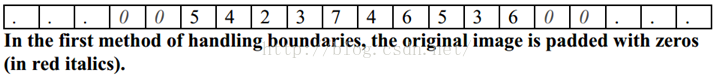
- 第二种方法也是想象I是无限图像的一部分。但没有指定的部分是用图像边界的值进行拓展。
- 在我们的例子中，因为图像I最左边的值I(1)=5，所以它左边的所有值，我们都认为是5 。而图像右边的所有的值，我们都认为和右边界的值I(10)一样，都是6。
- 这时候J(1)=(I(0)+I(1)+I(2))/3=(5+5+4)/3=14/3. 而J(10)=(I(9)+I(10)+I(11))/3=(3+6+6)/3=5。  
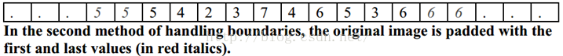
- 第三种情况就是认为图像是周期性的。也就是I不断的重复。周期就是I的长度。在我们这里，I(0)和I(10)的值就是一样的，I(11)的值和I(1)的值也是一样的。
- 所以J(1)=(I(0)+I(1)+I(2))/3=(I(10)+I(1)+I(2))/3=(6+5+4)/3=5 。  
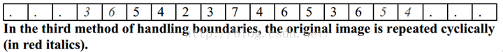
- 最后一种情况就是不管其他地方了。我们觉得I之外的情况是没有定义的，所以没办法使用这些没有定义的值，所以要使用图像I没有定义的值的像素都没办法计算。在这里，J(1)和J(10)都没办法计算，所以输出J会比原图像I要小。
-  这四种方法有各自的优缺点。如果我们想象我们使用的图像只是世界的一个小窗口，然后我们需要使用窗口边界外的值，那么一般来说，外面的值和边界上的值是几乎相似的，所以第二种方法可能更说得过去。
#### 滤波器、掩膜、核、模板、窗口是一个意思，本质是一个方阵矩阵。
- 对图像的滤波处理就是对图像应用不同的卷积核，下面我们一起来领略下不同的卷积核的效果：
- 啥也不做，这个滤波器啥也没有做，得到的图像和原图是一样的。因为只有中心点的值是1。邻域点的权值都是0，对滤波后的取值没有任何影响。
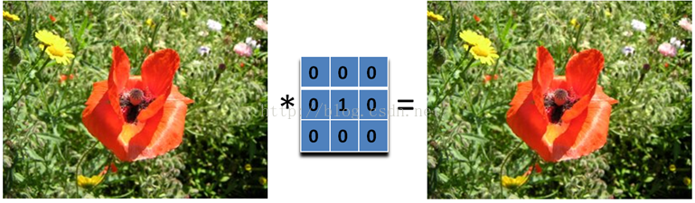
- 图像的锐化和边缘检测很像，首先找到边缘，然后把边缘加到原来的图像上面，这样就强化了图像的边缘，使图像看起来更加锐利了。
- 这两者操作统一起来就是锐化滤波器了，也就是在边缘检测滤波器的基础上，再在中心的位置加1，这样滤波后的图像就会和原始的图像具有同样的亮度了，但是会更加锐利。
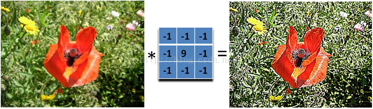
- 我们把核加大，就可以得到更加精细的锐化效果。
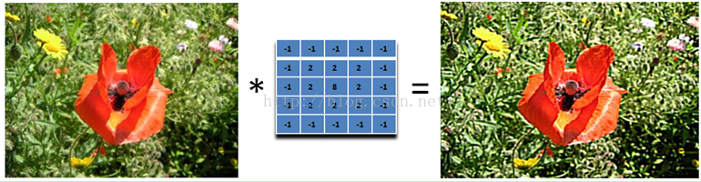
- 另外，下面的滤波器会更强调边缘：
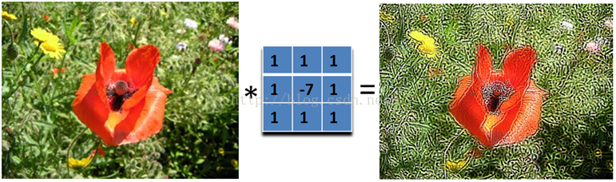
- 水平边缘检测(edge detection)：需要注意的是，这里矩阵的元素和是0，所以滤波后的图像会很暗，只有边缘的地方是有亮度的。  
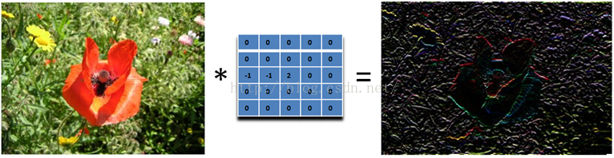
- 垂直边缘检测：
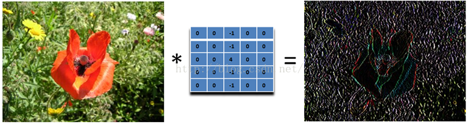
- 45度的边缘检测：取-2不为了什么，只是为了让矩阵的元素和为0而已。
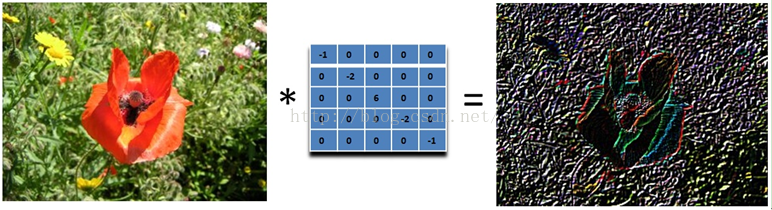
- 下面这个滤波器就可以检测所有方向的边缘:
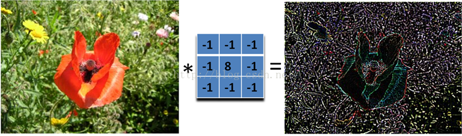
- 45度的浮雕滤波器。
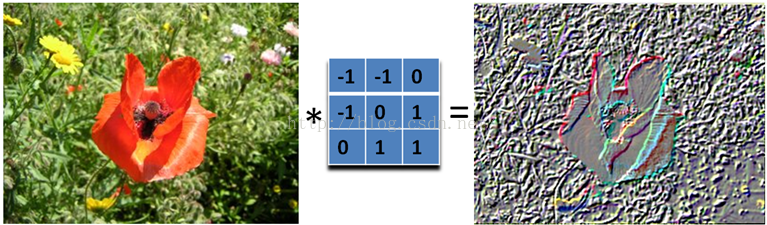
- 只要加大滤波器，就可以得到更加夸张的效果了。
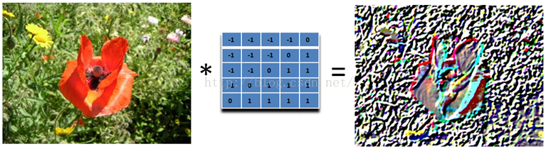
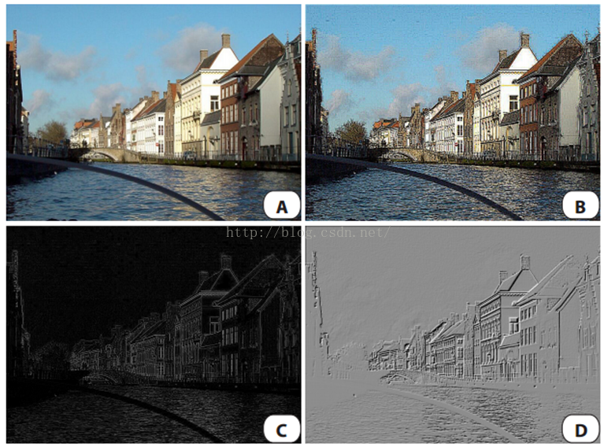
- A：原图像。B：锐化。C：边缘检测。D：浮雕。
- 均值模糊BoxFilter(Averaging)我们可以将当前像素和它的四邻域的像素一起取平均，然后再除以5，或者直接在滤波器的5个地方取0.2的值即可，如下图：
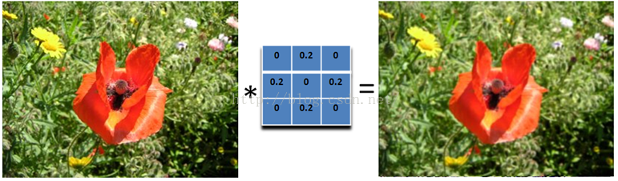
- 这个模糊还是比较温柔的，我们可以把滤波器变大，这样就会变得粗暴了：注意要将和再除以13.
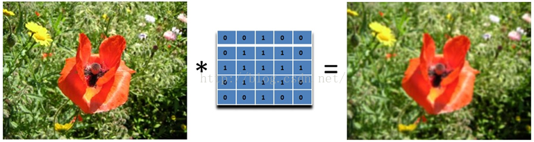
- 高斯模糊：均值模糊很简单，但不是很平滑。高斯模糊就有这个优点，所以被广泛用在图像降噪上。特别是在边缘检测之前，都会用来移除细节。高斯滤波器是一个低通滤波器。
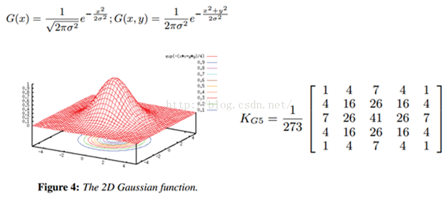
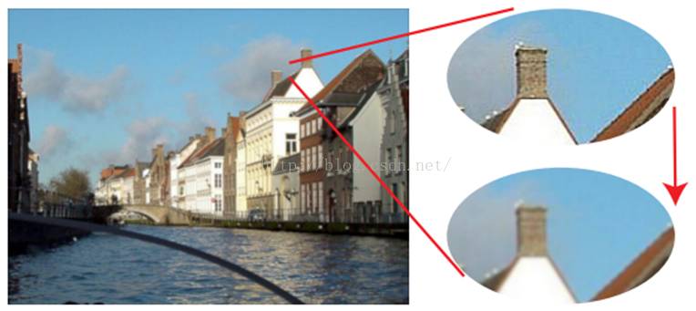
-  运动模糊可以通过只在一个方向模糊达到，例如下面9x9的运动模糊滤波器。注意，求和结果要除以9。
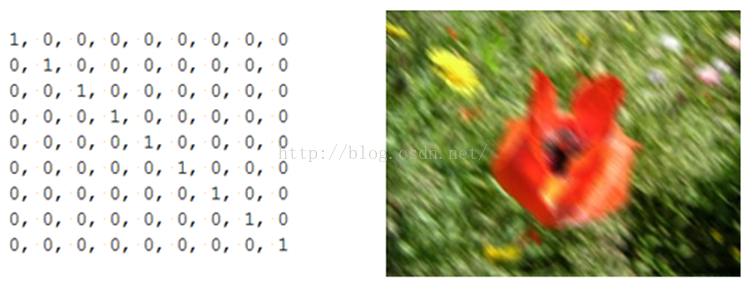
- 这个效果就好像，摄像机是从左上角移动到右下角。