## Spectral clustering
### 谱聚类概述
#### 谱聚类(spectral clustering)是广泛使用的聚类算法，比起传统的K-Means算法，谱聚类对数据分布的适应性更强，聚类效果也很优秀，同时聚类的计算量也小很多，更加难能可贵的是实现起来也不复杂。谱聚类(spectral clustering)是一种基于图论的聚类方法，主要思想是把所有的数据看作空间中的点，这些点之间可以用边连接起来。距离较远(或者相似度较低)的两个点之间的边权重值较低，而距离较近(或者相似度较高)的两个点之间的边权重值较高，通过对所有数据点组成的图进行切图，让切图后不同的子图间边权重的和尽可能的低，而子图内的边权重和尽可能的高，从而达到聚类的目的。与传统的聚类算法相比，它具有能在任意形状的样本空间上聚类且收敛于全局最优解的优点。
### 无向权重图
- 对于一个图G，我们一般用点的集合V和边的集合E来描述。即为G(V,E)。
- 其中V即为我们数据集里面所有的点(v1,v2,...vn)。对于V中的任意两个点，可以有边连接，也可以没有边连接。
- 我们定义权重wij为点vi和点vj之间的权重。由于我们是无向图，所以wij=wji。
- 对于有边连接的两个点vi和vj，wij>0,对于没有边连接的两个点vi和vj，wij=0。
- 对于图中的任意一个点vi，它的度di定义为和它相连的所有边的权重之和，即  
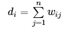
- 利用每个点度的定义，我们可以得到一个nxn的度矩阵D,它是一个对角矩阵，只有主对角线有值，对应第i行的第i个点的度数，定义如下：  
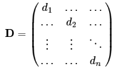
- 利用所有点之间的权重值，我们可以得到图的邻接矩阵W，它也是一个nxn的矩阵，第i行的第j个值对应我们的权重wij。  
- 另外，点集V的子集A，定义|A|:=子集A中点的个数，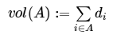
### 邻接矩阵(使用相似矩阵构建)
- 构建相似度的矩阵的过程中，可以使用欧氏距离、余弦相似度、高斯相似度等来计算数据点之间的相似度，在谱聚类中推荐使用的是高斯相似度。
- 构建邻接矩阵W的方法有3类。近邻法，k近邻法和全连接法。
#### ϵ近邻法
- 对于ϵ近邻法，它设置一个距离阈值ϵ，然后用欧氏距离度量任意两点之间的距离。即相似矩阵的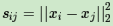，然后根据Sij和ϵ的大小关系，来定义邻接矩阵W如下： 
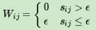  
- 从上式可见，两点间的权重要不就是ϵ，要不就是0，没有其他的值了。距离远近度量很不精确，因此在实际应用中，很少使用。
#### k近邻法
- K邻近法利用KNN算法遍历所有的样本点，取每个样本最近的k个点作为近邻，只有和样本距离最近的k个点之间的wij>0。
- 但是这种方法会造成重构之后的邻接矩阵W非对称，我们后面的算法需要对称邻接矩阵。为了解决这种问题，一般采取下面两种方法之一：
- 第一种K邻近法是只要一个点在另一个点的K近邻中，则保留Sij:  
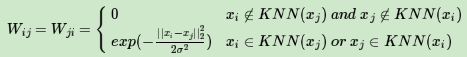 
- 第二种K邻近法是必须两个点互为K近邻中，才能保留Sij:  
 
#### 全连接法
- 相比前两种方法，全连接法所有的点之间的权重值都大于0，因此称之为全连接法。可以选择不同的核函数来定义边权重，常用的有多项式核函数，高斯核函数和Sigmoid核函数。最常用的是高斯核函数RBF，此时相似矩阵和邻接矩阵相同：  
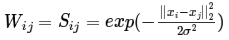  
- 实际应用中，使用第三种全连接法来建立邻接矩阵是最普遍的，而在全连接法中使用高斯径向核RBF是最普遍的。
### 拉普拉斯矩阵
- 构造拉普拉斯矩阵L=D-W(其中D为对角线元素为度的对角阵，W是图的邻接矩阵,拉普拉斯矩阵每一行所有元素和为0)：  
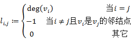  
- 构造归一化的拉普拉斯矩阵L(归一化的拉普拉斯矩阵的对角线元素为1，每一行所有元素和不在为0),即：  
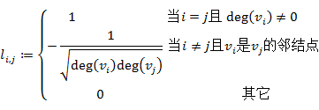
- 详细信息可参考[拉普拉斯矩阵](https://github.com/zhudingsuifeng/basicknowledge/blob/master/Laplacian%20matrix.md)。
### 切图聚类
- Graph Cut,简单地说就是把一个Graph的一些边切断，让她被打散成一些独立联通的sub-Graph,而这些被切断的权值的总和就被称为Cut值。
#### Mininum Cut切图
- 对于无向图G的切图，我们的目标是将图G(V,E)切成相互没有连接的k个子图，每个子图点的集合为A1,A2,...Ak,它们的并集是全集，交集是空集。
- 对于任意两个子图点的集合A,B,我们定义A和B之间的切图权重为：  
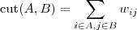  
- 那么：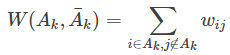  
- 对于k个子图点的集合A1,A2,...Ak,切图为：  
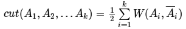
- 那么如何切图可以让子图内的点权重和高，子图间的点权重和低？
- 自然的想法是最小化cut(A1,A2,...Ak),但是存在选择权重最小的边缘点的情况并不是我们想要得到的，所以产生了下面两种方法。  

#### RatioCut切图
- 定义|Ai|=子集Ai中点的个数。现在对每个切图，不光考虑最小化cut(A1,A2...Ak),还同时考虑最大化每个子图点的个数，即：  
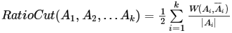
- 为了最小化这个RatioCut函数，我们引入指标向量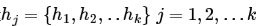对于任意一个向量hj它是一个n维向量(n为样本数)，我们定义hji为：  
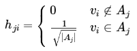
- 借助拉普拉斯矩阵特性，我们对于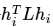有：  
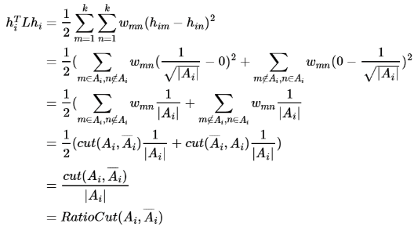
- 可以看出，对于某一个字图i，它的RatioCut对应于，  
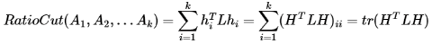
- 注意到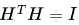，优化函数转化为：  
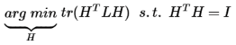
- 因为每一个h的取值只有两种可能，因此该准侧函数需要k*2^n中H，这是一个NP难问题。
- 优化函数可以对h利用拉格朗日乘子法进行求解，这样就可以利用瑞利熵来求解了。
- 注意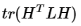中每一个优化子目标其中h是单位正交基，L为对称矩阵，此时的最大值为L的最大特征值，最小值是L的最小特征值。
- 对于，我们的目标是找到最小的L的特征值，而对于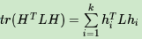，则我们的目标就是找到k个最小的特征值，一般来说，k远远小于n，也就是说，此时我们进行了维度规约，将维度从n降到k,从而近似可以解决这个NP难得问题。
- 通过找到L的最小的k个特征值，可以得到对应的k个特征向量，这k个特征向量组成一个nxk维度的矩阵，即为我们的H。一般需要对H里的每一个特征向量做标准化，即hi=hi/|hi|.
- 由于我们在使用维度规约的时候损失了少量信息，导致得到的优化后的指示向量h对应的H现在不能完全指示各样本的归属，因此一般在得到nxk维度的矩阵H后还需要对每一行进行一次传统的聚类，比如使用K-Means聚类.
#### NCut切图
- Ncut切图和RatioCut切图很类似，但是把RatioCut的分母|Ai|换成vol(Ai),由于子图样本的个数多并不一定权重就大，我们切图时基于权重也更合我们的目标，因此一般来说Ncut切图优于RatioCut切图。  
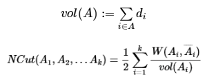
- 对应的，Ncut切图对指示向量h做了改进。注意到RatioCut切图的指示向量使用的是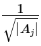标示样本归属，而Ncut切图使用了子图权重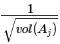来标示指示向量h，定义如下：  
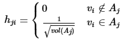
- 那么我们对于有：  
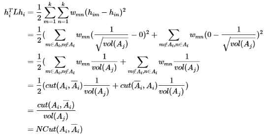
- 推导方式和RatioCut完全一致。也就是说，我们的优化目标仍然是：  
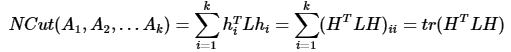
- 但是此时我们的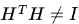而是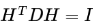，推导如下：  
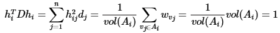
- 也就是说，此时我们的优化目标最终为：  
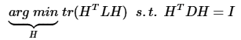
- 这个就是[泛化瑞利熵](https://github.com/zhudingsuifeng/basicknowledge/blob/master/Laplacian%20matrix.md)的求解问题。
- 令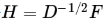，则优化目标转化为：  
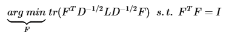
- 转化一下：  
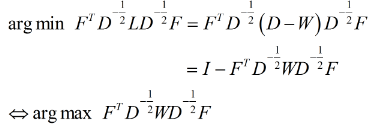
- 至此已经完成了NCut的理论。
### 谱聚类算法流程
1. 根据数据构造一个Graph,Graph的每一个节点对应一个数据点，将相似的点连接起来，并且边的权重用于表示数据之间的相似度。把这个Graph用邻接矩阵的形式表示出来，记为W.
2. 把W的每一列元素加起来得到N个数，把它们放在对角线上(其他地方都是0),组成一个N*N的矩阵，记为D。
3. 计算[拉普拉斯矩阵](https://github.com/zhudingsuifeng/basicknowledge/blob/master/Laplacian%20matrix.md),并构建标准拉普拉斯矩阵  

4. 求出L的前k个特征值(按照特征值的大小从小到大的顺序)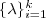以及对应的特征向量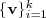.
5. 把这k个特征(列)向量排列在一起组成一个N*k的矩阵，将其中每一行看作k维空间中的一个向量，并使用K-means算法进行聚类。聚类结果中每一行所属的类别就是原来Graph中的节点也就是最初的N个数据点分别所属的类别。
### 算法总结
- 谱聚类算法是一个使用起来简单，但是讲清楚却不是那么容易的算法，它需要你有一定的数学基础。如果你掌握了谱聚类，相信你会对矩阵分析，图论有更深入的理解。同时对降维里的主成分分析也会加深理解。
- 谱聚类算法的优点：
1. 谱聚类只需要数据之间的相似度矩阵，因此对于处理稀疏数据的聚类很有效。这点传统聚类算法比如K-Means很难做到。
2. 由于使用了降维，因此在处理高维数据聚类时的复杂度比传统聚类算法好。
3. 由于抓住了主要矛盾，忽略了次要的东西，因此比传统的聚类算法跟家健壮一些，对于不规则的误差数据不那么敏感，而且performance也要好一些。事实上，在各种现代聚类算法的比较中，k-means通常都是作为baseline而存在的。
对于不规则的数据(或者说是离群点)不是那么敏感，个人感觉主要体现在最小化图切割的公式中（因为在RatioCut的优化策略中要除以一个分母|A|,表示当前聚类中含有点的个数；另外一种策略是Ncut，会除以一个分母vol(A),表示的是当前聚类中的点的度的集合；有了这两个分母的话，若是离群点单独成一个聚类，会造成这两个优化函数的值变大）。
k-means聚类算法比较适合于凸数据集（数据集内的任意两点之间的连线都在该数据集以内，简单理解就是圆形，可能不准确），而谱聚类则比较通用。
- 谱聚类算法的缺点：
1. 如果最终聚类的维度非常高，则由于降维的幅度不够，谱聚类的运行速度和最后的聚类的效果均不好。
2. 聚类效果依赖于相似矩阵，不同的相似矩阵得到的最终聚类效果和能很不同。
### 代码实现
```javascript
#!/usr/bin/env python
#coding=utf-8
import numpy as np
import matplotlib.pyplot as plt
from sklearn.cluster import KMeans
import math
import random
#生成两个高斯分布训练样本用于测试
#第一类样本类
mean1 = [0, 0]  
cov1 = [[1, 0], [0, 1]]  # 协方差矩阵  
x1, y1= np.random.multivariate_normal(mean1, cov1, 100).T  
data=[]  
for x,y in zip(x1,y1):  
    data.append([x,y])  
#第二类样本类  
mean2 = [3,3]  
cov2 = [[1, 0], [0, 1]]  # 协方差矩阵  
x2, y2= np.random.multivariate_normal(mean2, cov2, 100).T  
for x,y in zip(x2,y2):  
    data.append([x,y])  
random.shuffle(data)#打乱数据  
data=np.asarray(data,dtype=np.float32)   
#算法开始  
#计算两两样本之间的权重矩阵,在真正使用场景中，样本很多，可以只计算邻接顶点的权重矩阵  
m,n=data.shape  
distance=np.zeros((m,m),dtype=np.float32)   
for i in range(m):  
    for j in range(m):  
        if i==j:  
            continue  
        dis=sum((data[i]-data[j])**2)  
        distance[i,j]=dis  
#构建归一化拉普拉斯矩阵  
similarity = np.exp(-1.*distance/distance.std())#np.std()求标准差  
f=np.array(np.zeros([m,m]),dtype=np.float32)  
for i in range(m):  #归一化操作
    similarity[i,i]=-sum(similarity[i]) 
    similarity[i]=-similarity[i] 
    f[i,i]=1/math.sqrt(similarity[i,i]) #归一化的拉普拉斯矩阵的每一行和不在为0，对角线元素之为1 
x=np.matrix(similarity)
f=np.matrix(f)
x=f*x*f
similarity=np.array(x) 
#计算拉普拉斯矩阵的前k个最小特征值  
[Q,V]=np.linalg.eig(similarity)  
idx = Q.argsort()  
Q = Q[idx]  
V = V[:,idx]  
#前3个最小特征值  
num_clusters =3  
newd=V[:,:3]  
#k均值聚类  
clf = KMeans(n_clusters=num_clusters)  #KMeans是一个类，clf是对象，是真正执行计算的实例。  
clf.fit(newd)  #Compute K-means clustering.
#显示结果  
for i in range(data.shape[0]):  
    if clf.labels_[i]==0:  
        plt.plot(data[i,0], data[i,1], 'go')  
    elif clf.labels_[i]==1:  
        plt.plot(data[i,0], data[i,1], 'ro')  
    elif clf.labels_[i]==2:  
        plt.plot(data[i,0], data[i,1], 'yo')  
    elif clf.labels_[i]==3:  
        plt.plot(data[i,0], data[i,1], 'bo')  
plt.show()
```