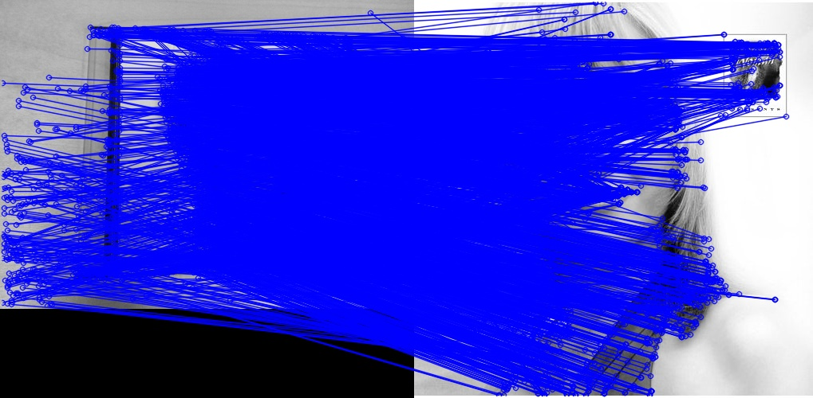
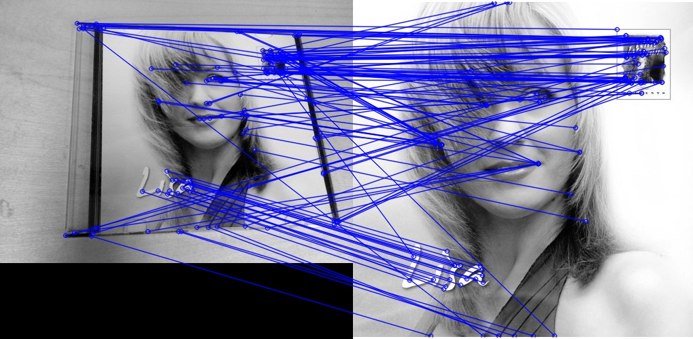
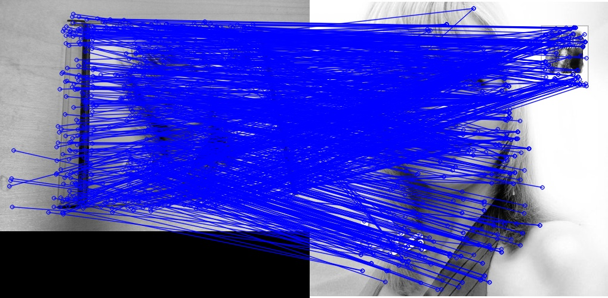
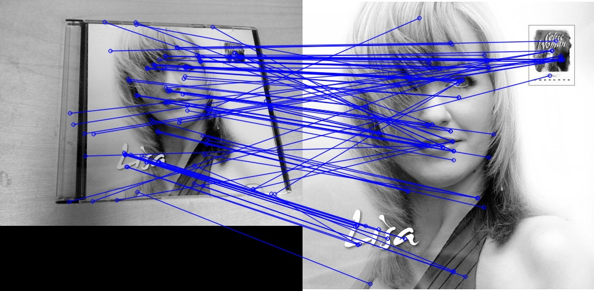
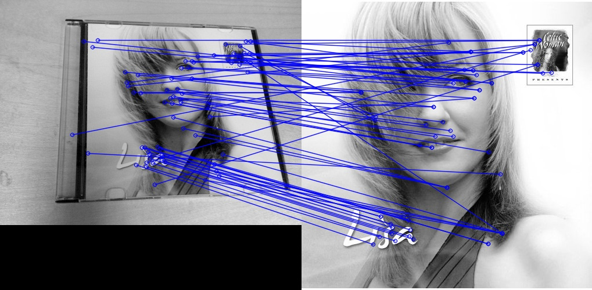
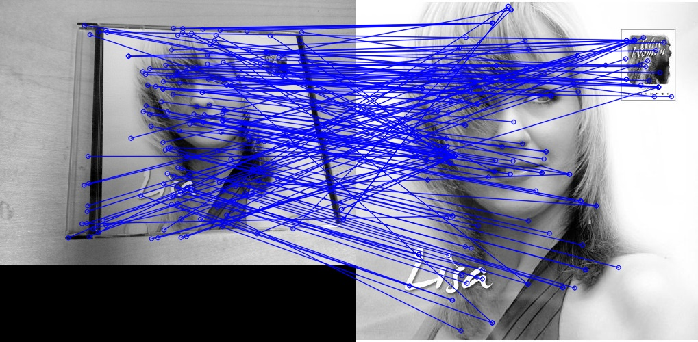
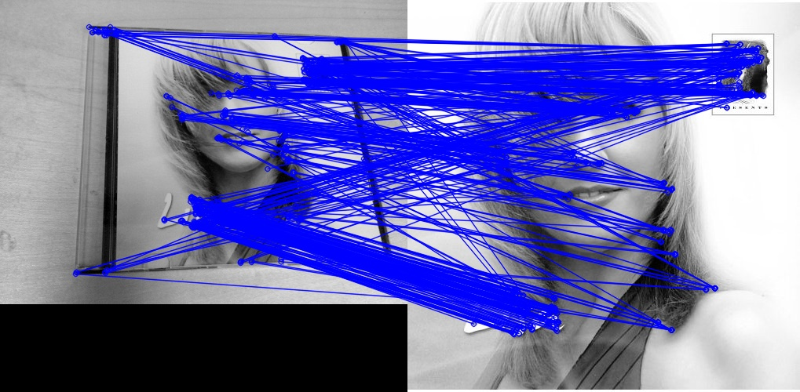

#### opencv的一些函数原理，和用法。
- opencv图片缩小尺寸原理。
- 原始图像为M\*N,缩小后图像大小要求为m\*m,则需要将图像划分为(M\*N)/(m\*n)大小的互不相交的小块，计算小块的平均值，该值作为缩小图像对应的像素值。
- 我们把16\*16的图像缩小成4\*4的图像：  

|65|187|56|198|92|69|116|207|236|19|3|154|40|44|34|25|
|:-:|:-:|:-:|:-:|:-:|:-:|:-:|:-:|:-:|:-:|:-:|:-:|:-:|:-:|:-:|:-:|
|**77**|**8**|**28**|**188**|**125**|**117**|**205**|**71**|**187**|**187**|**209**|**15**|**202**|**244**|**56**|**192**|
|**168**|**213**|**140**|**189**|**91**|**83**|**105**|**239**|**38**|**235**|**185**|**235**|**203**|**201**|**161**|**230**|
|**231**|**67**|**204**|**20**|**79**|**214**|**183**|**230**|**107**|**209**|**141**|**57**|**103**|**34**|**160**|**148**|
|**251**|**73**|**207**|**203**|**89**|**234**|**66**|**60**|**131**|**190**|**68**|**20**|**102**|**93**|**196**|**14**|
|**136**|**72**|**39**|**49**|**136**|**123**|**54**|**143**|**132**|**55**|**117**|**207**|**197**|**25**|**240**|**1**|
|**165**|**59**|**202**|**0**|**246**|**186**|**9**|**163**|**163**|**190**|**123**|**104**|**29**|**103**|**59**|**196**|
|**171**|**132**|**92**|**147**|**128**|**181**|**18**|**72**|**170**|**224**|**71**|**107**|**229**|**189**|**161**|**70**|
|**217**|**41**|**170**|**230**|**64**|**39**|**45**|**230**|**241**|**29**|**103**|**105**|**140**|**19**|**173**|**213**|
|**191**|**147**|**199**|**147**|**246**|**8**|**114**|**238**|**27**|**113**|**193**|**94**|**75**|**240**|**175**|**57**|
|**12**|**73**|**158**|**118**|**241**|**236**|**203**|**43**|**237**|**52**|**62**|**135**|**246**|**91**|**156**|**128**|
|**217**|**228**|**151**|**118**|**146**|**243**|**224**|**102**|**37**|**225**|**139**|**116**|**105**|**209**|**24**|**96**|
|**31**|**38**|**218**|**18**|**20**|**105**|**229**|**163**|**100**|**143**|**88**|**236**|**38**|**133**|**201**|**240**|
|**86**|**229**|**180**|**56**|**198**|**49**|**21**|**218**|**36**|**103**|**61**|**42**|**39**|**244**|**42**|**241**|
|**70**|**147**|**34**|**112**|**27**|**43**|**216**|**181**|**169**|**170**|**137**|**126**|**9**|**36**|**234**|**61**|
|**49**|**127**|**115**|**211**|**219**|**251**|**240**|**236**|**57**|**59**|**186**|**227**|**41**|**193**|**222**|**198**|

|65|187|56|198|
|:-:|:-:|:-:|:-:|
|**77**|**8**|**28**|**188**|
|**168**|**213**|**140**|**189**|
|**231**|**67**|**204**|**20**|
- aver=(65+187+56+198+77+8+28+188+168+213+140+189+231+67+204+20)/16=127
- 以此类推，得到缩小后的矩阵： 

|127|139|139|130|
|:-:|:-:|:-:|:-:|
|**125**|**119**|**130**|**119**|
|**151**|**151**|**119**|**134**|
|**108**|**151**|**121**|**136**|
```javascript
import cv2
cv2.resize(src,dsize) ->dst
src- input image
dsize- output image size
dst- output image
```
```javascript
import matplotlib.pyplot as plt
plt.figure()    #Create a new figure.Notes: If you are creating many figures, make sure you explicitly call "close" on the figures you are not using,because this will enable pylab to properly clean up the memory.
plt.draw()      #Redraw the current figure.
plt.close()     #Close a figure window. And memory recovery.
plt.plot(x,y)   #plot x and y using default line style and color.
plt.axis('off') #Turns off the axis lines and labels
```
```javascript
import cv2
sift=cv2.SIFT()     #创建sift对象失败，报错
#AttributeError:'module' object has no attaibute 'SIFT'
#pip install opencv_contrib_python
sift=cv2.xfeatures2d.SIFT_create()     #问题解决
kp=sift.detect(gray,None)       #返回一个包含一系列keypoint(关键点)的list
print(type(kp),type(kp[0]))     #kp属于list类型，kp[0]属于cv2.KeyPoint类型
print(kp[0].pt)                 #返回KeyPoint(关键点)kp[0]的坐标pt
des=sift.compute(gray,kp)       #返回一个描述符元组tuple
print(type(des),type(des[0]),des[0])  #des属于tuple类型，des[0]属于list类型，内容是一系列的<KeyPoint 0x304a2d0>
print(type(des[1]),des[1])      #des[1]属于多维数组numpy.ndarray类型，The output matrix of descriptors.每一维多是对一个keypoint的描述。
print(des[1].shape)             #Tuple of array dimensions.返回元组每一维的大小，shape属性list并没有。
bf=cv2.BFMatcher()              #BF和FLANN是opencv二维特征点匹配常见的两种方法，分别对应BFMatcher和FlannBasedMatcher.
#BFMatcher总是尝试所有可能的匹配，从而使得他总能够找到最佳匹配。FlannBasedMatcher是一种近似法，算法更快但是找到的是最近邻近似匹配，当我们需要一个相对好的匹配但是不需要最佳匹配的时候可以使用FlannBasedMatcher.
matches=bf.knnMatch(des1,des2,k=2) #knnMatch(queryDescriptors,trainDescriptors,k) trainDescriptors-dataset of descriptors furnished by user(用户提供的描述符数据集),k-number of the closest descriptors to be returned for every input query(每个输入查询返回的最接近的描述符数).
kp,des=sift.detectAndCompute(gray,None)
des=sift.compute(gray,kp)
kp,des=sift.compute(gray,kp) #这两种形式都可以，前一个返回矩阵，后面返回两个list
```
- L1 norm就是绝对值相加，又称曼哈顿距离，L2 norm就是欧几里得距离。
- FlannBsdrfMatcher,need to pass two dictionaries which specifies the algorithm to be used,its related parameters etc.First one is IndexParams.As a summary, for algorithms like SIFT you can pass following:
- index_params=dict(algorithm=FLANN_INDEX_KDTREE,trees=5)
- Second dictionary is the SearchParams.It specifies the number of times the trees in the index should be recursively traversed.Higher values gives better precidion,but also takes more time.If you want to change the value,pass search_params=dict(checks=100)
```javacript
#For FLANN based matcher,we need to pass two dictionaries which specifies the algorithm to be used, its related parameters etc. First one is IndexParams.for various algorithms,the information to be passed is explained in FLANN docs.As a summary, for algorithms like SIFT,SURF etc.you can pass following:
FLANN_INDEX_KDTREE=0
index_params=dict(algorithm=FLANN_INDEX_KDTREE,trees=5)
search_params=dict(checks=50)
flann=cv2.FlannBasedMatcher(index_params,search_params)
#While using ORB,you can pass the following.The commented values are recommended as per the docs,but it didn't provide required results in some cases.Other values worked fine.:
FLANN_INDEX_LSH=6   #I don't know what this means.
index_params=dict(algorithm=FLANN_INDEX_LSH,table_number=6,key_size=12,multi_probe_level=1)
search_params=dict(checks=50)
flann=cv2.FlannBasedMatcher(index_params,search_params)
#draw images likes following:
matches=flann.knnMatch(desa,desb,k=2)
#store all the good matches as per lowe's ratio test.
good=[]
for m,n in matches:
	if m.distance<0.7*n.distance:
		good.append(m)
img3=cv2.drawMathces(imga,kpa,imgb,kpb,good,flags=2)
#AttributeError:'module' object has no attribute 'drawMathes'
plt.imshow(img3)
plt.show()
#出现上述报错，说是因为opencv版本问题(我在并不是必要的情况下，没有冒险更改版本，所以没有证实问题的可靠性)。我的opencv是2.4.5,需要3.0.0.
#查看opencv版本的方法：
$python
>>>import cv2
>>>cv2.__version__
'2.4.5'
#python2 -m pip install opencv-python   #can't solve the problem
#python2 -m pip uninstall opencv-python   #uninstall opencv-python,avoid affecting the program.
#python2 -m pip install opencv-contrib-python    #success
$python
>>>import cv2
>>>cv2.__version__
'3.3.0'
python2 -m pip install somepackages    #install package with phthon2
```
- opencv的feature2d module中提供了从局部图像特征(local image feature)的检测、特征向量(feature vector)的提取，到特征匹配的实现。
- 其中的局部图像特征包括了常用的几种局部图像特征检测与描述算子，如FAST、SURF、SIFT以及ORB。
- 对于高位特征向量之间的匹配，opencv主要有两种方式：1、BruteForce穷举法；2、FLANN近似K近邻算法(包含了多种高维特征向量匹配的算法，例如随机森林等)。  
1. FAST+SIFT+FLANN （即局部图像特征检测算子+特征向量描述算子+高维特征向量匹配方法）  

2. HARRIS+SIFT+FLANN  

3. SURF+SIFT+FLANN  

4. MSER+SIFT+FLANN  

5. STAR+SIFT+FLANN   

6. SIFT+SIFT+FLANN  

7. ORB+ORB+FLANN  

#### knnMatch(desa,desb,k=2)
```javascript
flann=cv2.FlannBasedMatcher(index_params,search_params)
matches=flann.knnMatch(desa,desb,k=2)
#Each matches[i] is k or less matches for the same query descriptor.
#k Count of best matches found per each query descriptor or less if a query descriptor has less than k possible matches in total.
for m,n in matches:    #ValueError: need more than 1 value to unpack
for m in matches:
	if len(m)==2:      #always has two values
		if m[0].distance<0.96*m[1].distance:
			good.append([m[0]])          #solved the problem.
python2
>>>import cv2
>>>help(cv2.FlannBasedMatcher().knnMatch)
knnMatch(...)
knnMatch(queryDescriptors,trainDescriptors,k[,mask[,compactResult]])->matches
@brief Finds the k best matches for each descriptor from a query set.
@param queryDescriptors Query set of descriptors.
@param trainDescriptors Train set of descriptors.This set is not added to the train descriptors collection stored in the class object.
@param matches Matches.Each matches[i] is k or less matches for the same query descriptor.
@param k Count of best matches found per each query descriptor or less if a query descriptor has less than k possible matches in total.
```