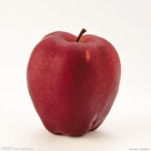
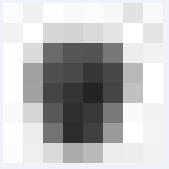
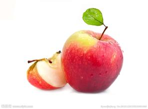
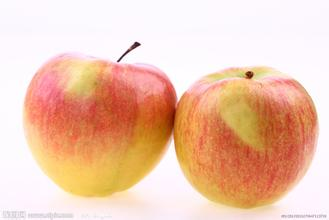
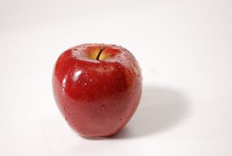
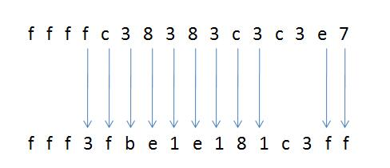
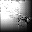

## 余弦变换哈希感知算法(pHash)
### 均值哈希感知算法(aHash)
- 哈希感知算法基本原理如下：
1. 把图片转成一个可识别的字符串，这个字符串也叫哈希值。
2. 和其他图片匹配字符串。
- 以一张图片举例：  

- 首先，把这个图片缩小到8x8大小，并改成灰度模式。这样是为了模糊化处理图片，并减少计算量。
- 8x8的图片太小了，放大图片给大家看一下。  

- 8x8大小的图片就是有64个像素值。计算这64个像素的平均值，进一步降噪处理。
像素值=[
     247, 245, 250, 253, 251, 244, 240, 240, 
     247, 253, 228, 208, 213, 243, 247, 241, 
     252, 226, 97, 80, 88, 116, 231, 247, 
     255, 172, 79, 65, 51, 58, 191, 255, 
     255, 168, 71, 60, 53, 69, 205, 255, 
     255, 211, 65, 58, 56, 104, 244, 252, 
     248, 253, 119, 42, 53, 181, 252, 243, 
     244, 240, 218, 175, 185, 230, 242, 244]
- 平均值=185.359375
- 得到这个平均值之后，再和每个像素对比。像素值大于平均值的标记成1，小于或等于平均值的标记成0。组成64个数字的字符串(看起来也是一串二进制的)。
降噪结果=[
       1, 1, 1, 1, 1, 1, 1, 1, 
       1, 1, 1, 1, 1, 1, 1, 1, 
       1, 1, 0, 0, 0, 0, 1, 1, 
       1, 0, 0, 0, 0, 0, 1, 1, 
       1, 0, 0, 0, 0, 0, 1, 1, 
       1, 1, 0, 0, 0, 0, 1, 1, 
       1, 1, 0, 0, 0, 0, 1, 1, 
       1, 1, 1, 0, 0, 1, 1, 1]
- 64位字符串 = '1111111111111111110000111000001110000011110000111100001111100111'
- 由于64位太长，比较起来也麻烦。每4个字符为1组，由2进制转成16进制。这样就剩下一个长度为16的字符串。这个字符串也就是这个图片可识别的哈希值。
- 哈希值 = 'ffffc38383c3c3e7'
- 看其他图片的哈希值：  

- b.jpg :fff3fbe1e181c3ff  

- c.jpg :ffffdf818080d9f9  

- d.jpg :ffffcfc7c7c3c7ef  
- 这3张图片的哈希值分别和a.jpg(举例的那张图片)的哈希值对比。对比方法用汉明距离：相同位置上的字符不同的个数。例如a.jpg和b.jpg对比。  

- 有11个位置的字符不一样，则汉明距离是11。汉明距离越小就说明图片越相识。超过10就说明图片很不一样。
- a.jpg和c.jpg的汉明距离是8；
- a.jpg和d.jpg的汉明距离是7。
- 说明在这3张图片中，d.jpg和a.jpg最相似。
- 实际应用中很少用这种算法，因为这种算法比较敏感。同一张图片旋转一定角度或者变形一下，那个哈希值差别就很大。不过，它的计算速度是最快的，通常可以用于查找缩略图。
- pHash算法是基于dHash算法调整而来的，用第一次计算得到的值进行余弦变换。所以命名为余弦哈希感知算法。它可以识别变形程度在25%以内的图片。
- 大致原理和处理过程是这样：
- 把图片缩小到32x32的尺寸，并转为灰度模式。  

#### 对图片进行二维余弦变换，得到下图。高亮的数据集中在左上角。  

- 离散余弦变换(DCT)是一种图像压缩算法，它将图像从像素域变换到频率域。然后一般图像都存在很多冗余和相关性，所以转换到频率域之后，只有很少部分频率分量的系数才不为0，大部分系数都为0(或者说接近于0)。从左上角依次到右下角，频率越来越高，左上角的值比较大，到右下角的值就很小很小了。换句话说，图像的能量几乎都集中在左上角这个地方的低频系数上面了。
- 主要特征数据就集中在图片左上角的区域，我们去左上角的8x8区域。对这个区域求均值哈希值
像素值 = [
    185.6844940185547, 265.2283630371094, 295.5816650390625, 280.8827209472656, 194.1041259765625, 202.2652130126953, 219.96258544921875, 292.495361328125, 178.82818603515625, 233.83262634277344, 273.0287170410156, 149.4671630859375, 168.61572265625, 196.33615112304688, 203.49485778808594, 212.27850341796875, 132.66966247558594, 129.8767852783203, 158.14573669433594, 130.48318481445312, 183.61569213867188, 163.86473083496094, 130.6190643310547, 97.9937515258789, 62.876373291015625, 139.2428436279297, 104.12135314941406, 84.58297729492188, 65.413818359375, 50.1722297668457, 32.628944396972656, 15.74152660369873, 291.3837890625, 352.196044921875, 362.098388671875, 359.0899353027344, 435.290771484375, 385.5643310546875, 471.4906005859375, 341.85638427734375, 364.1877136230469, 376.7964172363281, 379.27386474609375, 259.00885009765625, 311.5459289550781, 309.8655700683594, 277.6601867675781, 237.609375, 203.56141662597656, 181.1670684814453, 178.15585327148438, 250.11349487304688, 233.9508514404297, 220.26385498046875, 179.6764678955078, 163.84234619140625, 129.07568359375, 149.32899475097656, 126.58440399169922, 104.8794174194336, 85.072265625, 61.521141052246094, 42.12876510620117, 21.413537979125977
]
- 平均值 = 204.3717007189989
- 得到这个平均值之后，再和每个像素对比。像素值大于平均值的标记成1，小于或等于平均值的标记成0。组成64个数字的字符串(看起来也是一串二进制的)。
降噪结果 = [
    0, 1, 1, 1, 0, 0, 1, 1,
    0, 1, 1, 0, 0, 0, 0, 1,
    0, 0, 0, 0, 0, 0, 0, 0,
    0, 0, 0, 0, 0, 0, 0, 0,
    1, 1, 1, 1, 1, 1, 1, 1,
    1, 1, 1, 1, 1, 1, 1, 1,
    0, 0, 0, 1, 1, 1, 0, 0,
    0, 0, 0, 0, 0, 0, 0, 0]
- 64位字符串 = '0111001101100001000000000000000011111111111111110001110000000000'
- 每4个数字，由2进制转成16进制，得到哈希值 = '73610000ffff1c00'
- 用这个算法计算哈希值对比的汉明距离。